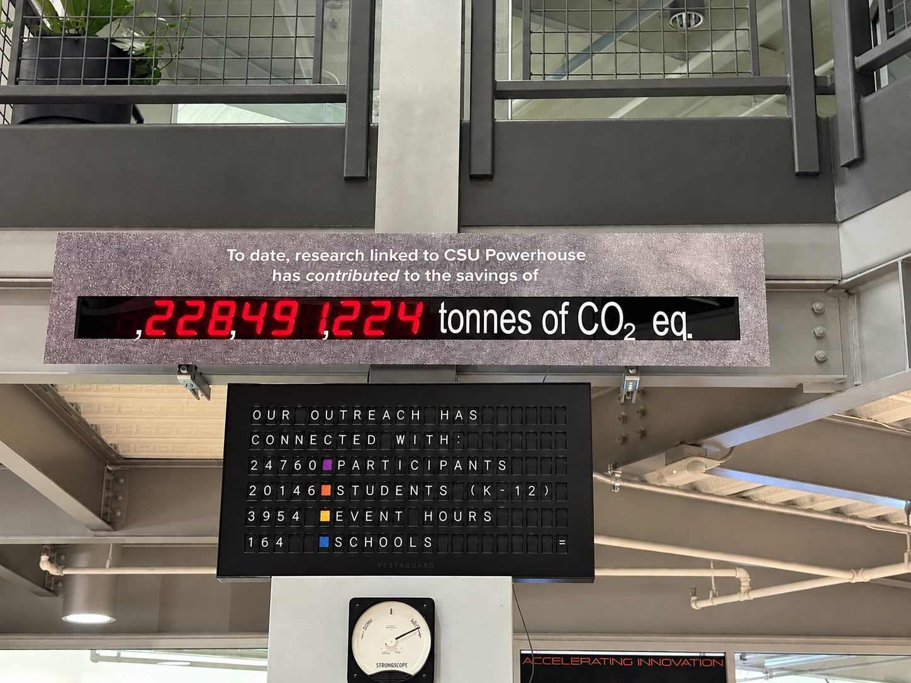

# About

As a Colorado native, it was the mountains that taught me to love the
environment. As a gearhead, it was cars that brought me to mechanical
engineering. My passions lie where these two meet: emissions and aerosol
research.

## Purpose

This is the picture that I am met with every single time I step foot in my
research lab, and it is this idea that keeps me going when the project is hard.
I know that my research is making an impact on the environment, protecting the
mountains for generations to come.

## What I'm looking for

I would love to contribute to your team to help better the world! An
internship, hands-on engineering experience, or anything else that will create
a better future.

The best way to reach me is [email](/contact).
