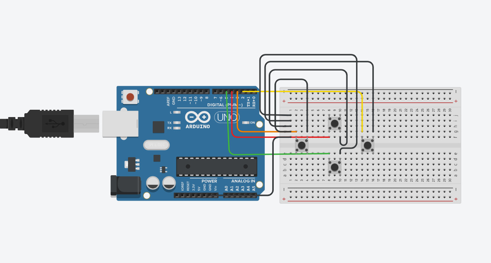
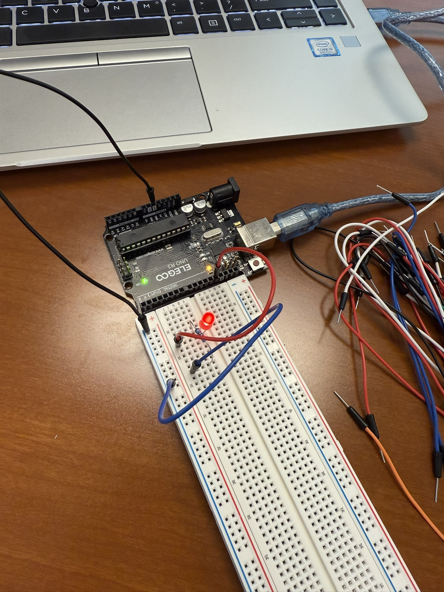
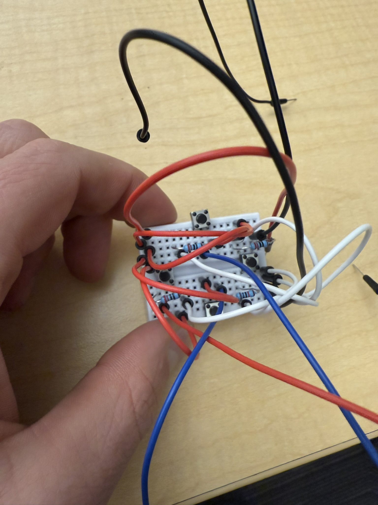
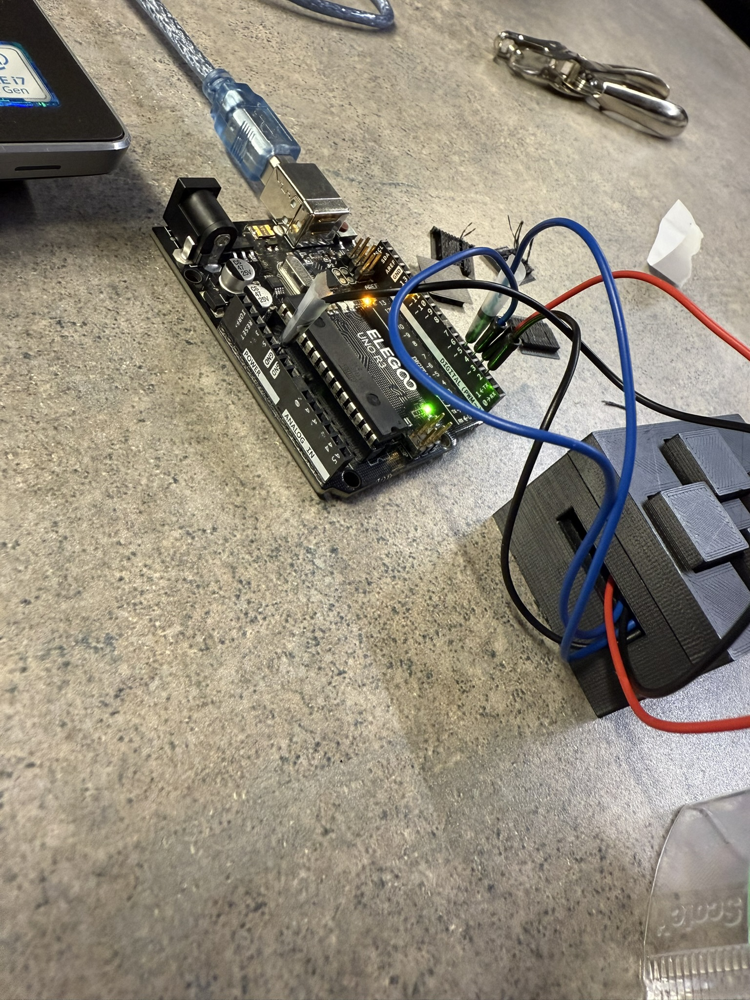

## The problem

Build a working escape room in six weeks with a four-person team, where the
software and the hardware both have to hold up in front of an audience that gets
exactly one attempt.

## The build

The puzzle logic runs on an **Arduino talking to MATLAB**, with a background
timer running the whole time and a custom **3D-printed controller** as the
physical interface players actually touch.

I laid the circuit out before wiring it, then prototyped it on the bench where a
mistake costs a jumper wire instead of a rebuild.

Once the logic was proven, it moved onto more permanent hardware.

An escape room is an unusually unforgiving thing to build electronics for.
Players pull, press, and twist things harder than you do while testing, and a
connection that merely *works* on the bench isn't enough — it has to survive
being handled by someone who doesn't know how it's put together and is under
time pressure.

## The harder problem

The technical work wasn't the real challenge. Partway through, it became clear
the team wasn't going to finish with its current makeup, and I had to remove an
underperforming member and redistribute their work with the deadline unchanged.

That was the actual leadership challenge, and it's the part I learned most from —
mostly that I waited longer than I should have to make the call, hoping the
situation would correct itself.

## Result

A finished, working escape room delivered on schedule, and a much more concrete
sense of what it costs to make a personnel decision rather than hope a problem
resolves itself.
