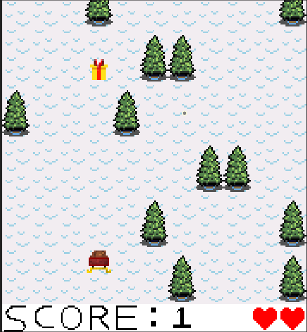
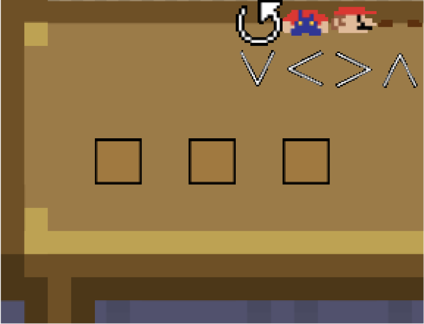
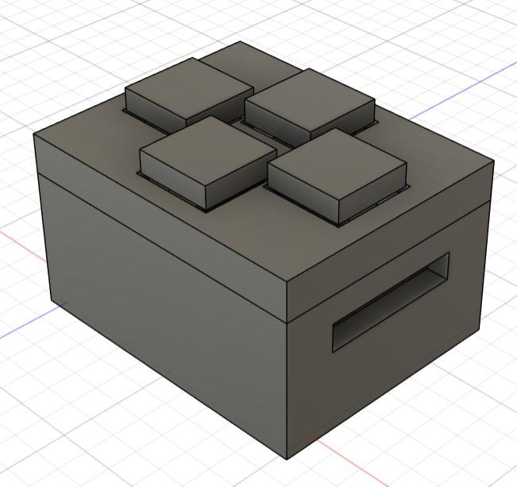

## The problem

Build a working escape room in six weeks with a four-person team, where the
software and the hardware both have to hold up in front of an audience that gets
exactly one attempt.

We built **Escape the North Pole**: three rooms, each a Christmas-themed task —
make the toys, collect them, then deliver them to the children of Fort Collins.

## My room: the sleigh game

The second room was mine.

You fly a sleigh, collect ten presents, and avoid the trees. Three lives, shown
as hearts, and running out ends the run.

The design decision I'm happiest with is the smallest one: **no trees spawn until
the first present is collected.** That gap gives a new player a few seconds to
work out that the buttons steer the sleigh before anything can punish them for
not knowing. It's an unprompted tutorial that costs nothing and doesn't
interrupt the game — and it exists because watching someone play for the first
time is very different from playing it yourself.

The other two rooms were a timed toy-assembly puzzle and a present-delivery
round.

## The controller

Players don't touch a keyboard. Input is a **custom 3D-printed D-pad** I modelled
in CAD: a base that houses the breadboard, four printed button caps, and a lid
that captures them.

The base has a slot in its side for the five wires — ground plus four data lines
— so the cable exits cleanly rather than being pinched under the lid.

I laid the circuit out before wiring it and prototyped it on the bench, where a
mistake costs a jumper wire instead of a rebuild.

The tolerance on the printed buttons turned out to matter more than anything
electrical. Printed too loose, a cap lifts out of the lid and comes away on the
player's finger — so the fix was wrapping tape around the narrow end of each
button until the fit held. That's the kind of detail that only shows up when
someone who didn't build it starts pressing things under time pressure.

## The harder problem

The technical work wasn't the real challenge. Partway through, it became clear
the team wasn't going to finish with its current makeup, and I had to remove an
underperforming member and redistribute their work with the deadline unchanged.

That was the actual leadership challenge, and the part I learned most from —
mostly that I waited longer than I should have to make the call, hoping the
situation would correct itself.

## Result

A finished, working escape room delivered on schedule, with a written user manual
so someone else could set it up and run it without us in the room.
