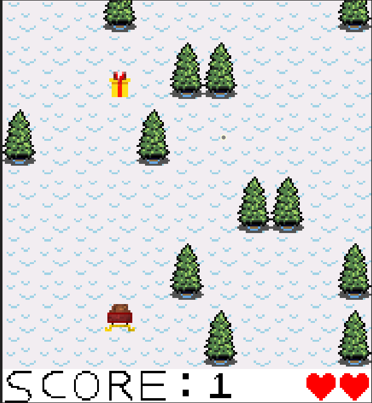
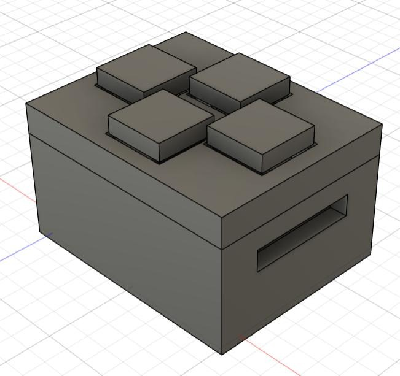
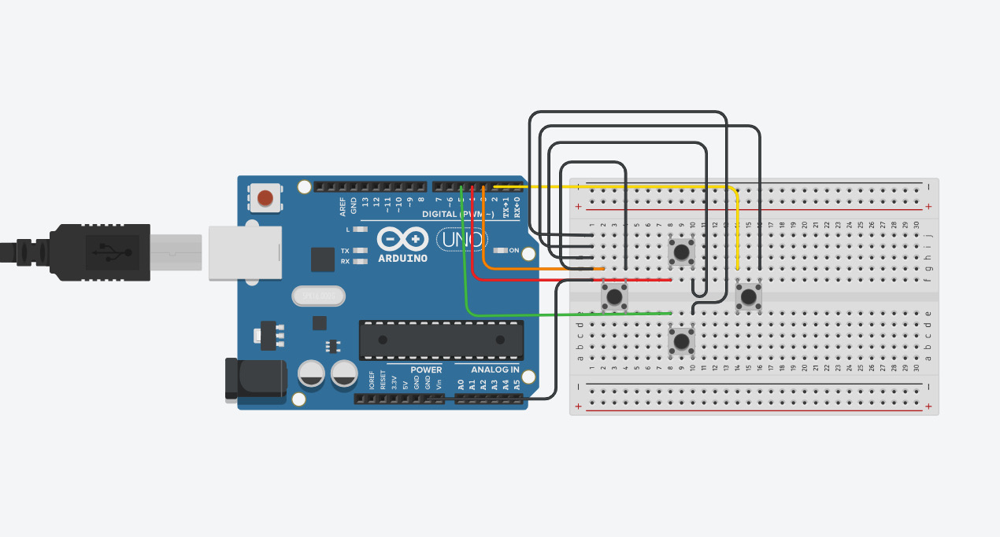
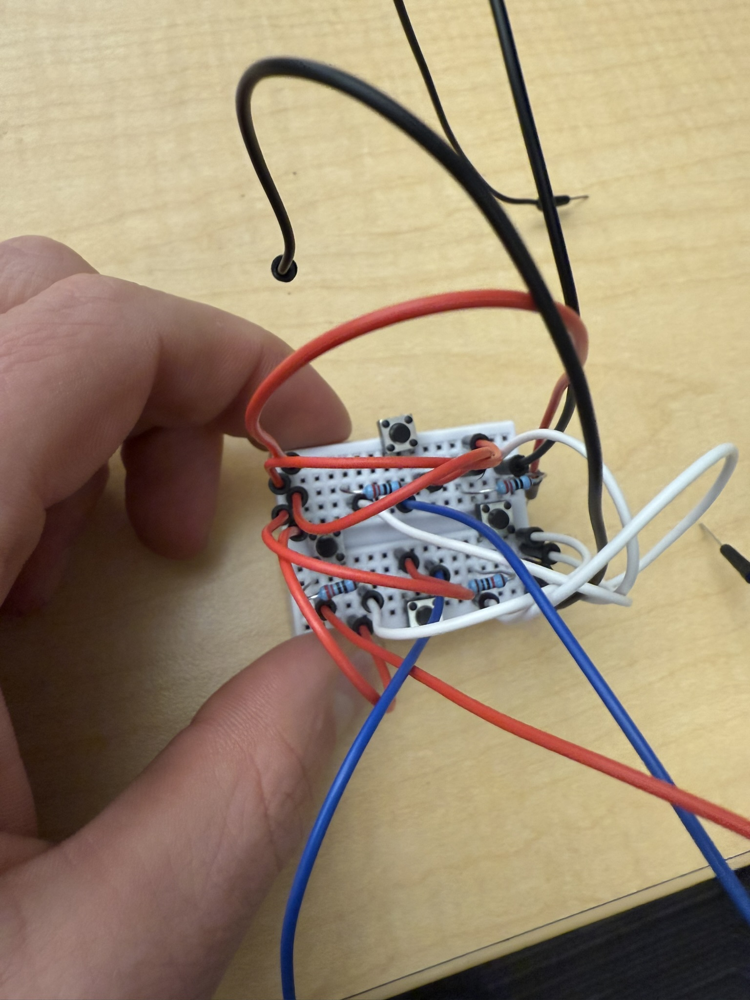

## The problem

This was a fun group project for one of my engineering classes. We were tasked with designing a puzzle-based video game with multiple levels and an interwoven story. We chose to make ours about Christmas: making, collecting, and delivering the presents just in time to save the day.

## My room: the sleigh game

I was in charge of designing the second room: collecting the presents.

You control a sleigh, collect ten presents, and avoid the trees. You have three lives, shown as hearts at the bottom. Hitting a tree costs you a life, and the game ends if you lose all three.

Designing a video game in MATLAB is quite the challenge. Using software designed for data analysis to make an interactive game is difficult, but it also provides opportunities for clever solutions.

For me, this meant deepening my understanding of what matrices are and how they work, especially in the context of engineering. Knowing which cells to manipulate, and how, is a very useful skill, particularly in data analysis.

## The controller

Instead of using keyboard inputs, players use a custom 3D-printed D-pad I designed in Fusion 360.

The slot in the side is for the wires going to the circuit on the inside of the box.

I spent an afternoon deepening my understanding of basic push button circuits, and why a pull-up resistor is so important in these kinds of circuits.

## Result

A fun, engaging escape room made in software designed to analyze data.
