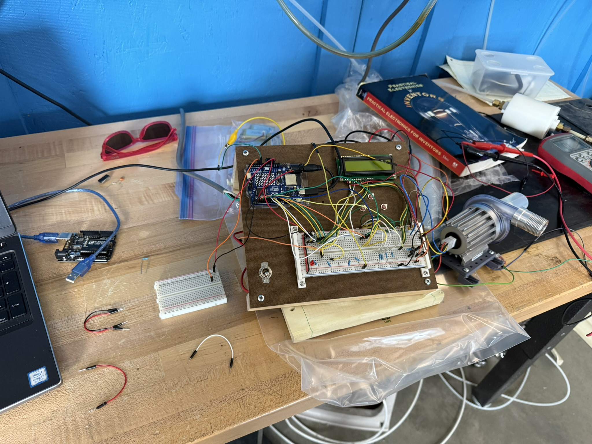
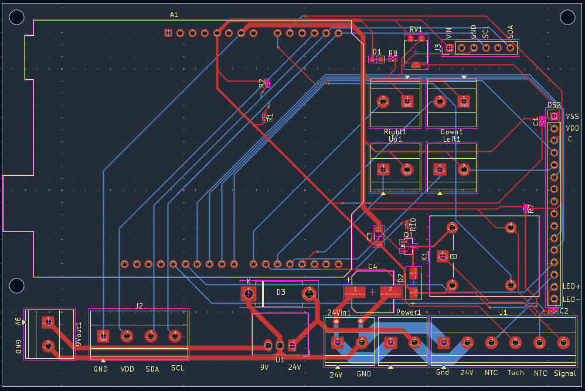
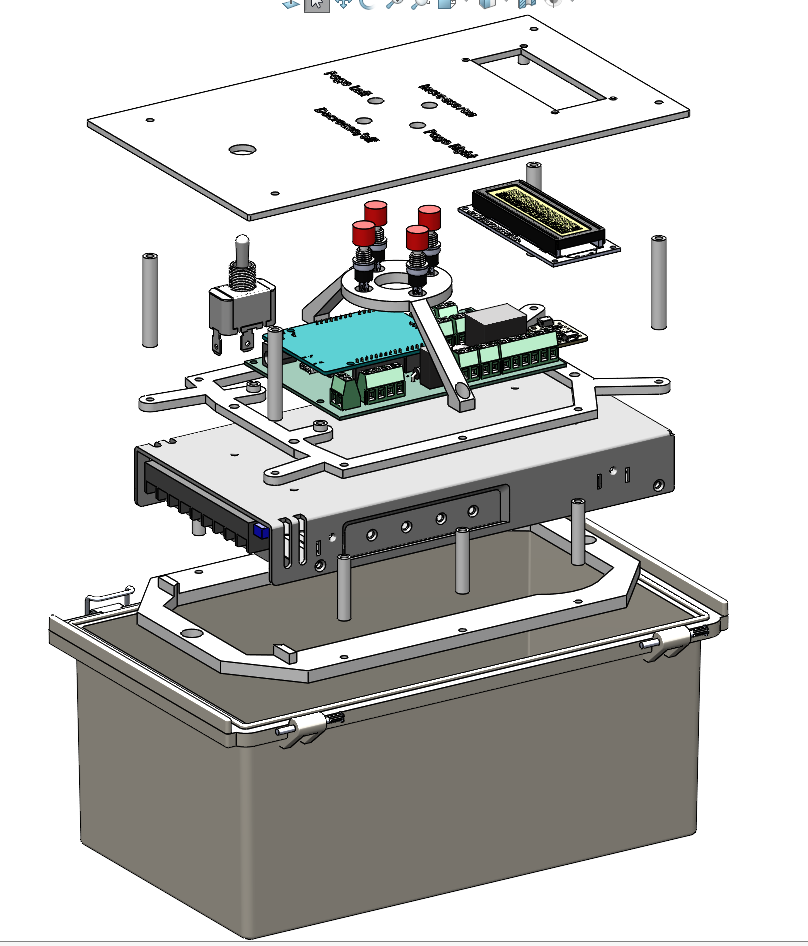
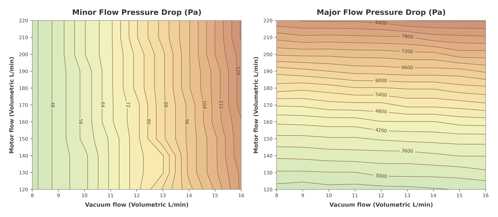
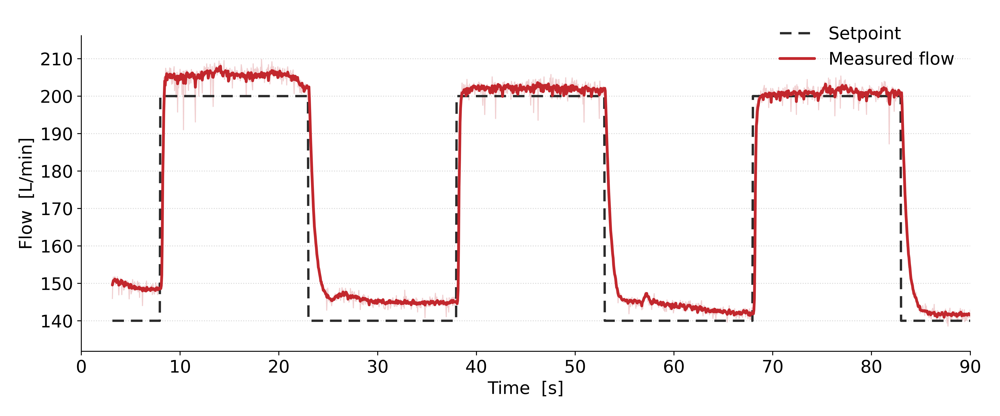

## The problem

The instrument is a **virtual impactor** — a high-flow-rate bioaerosol sampler
that separates particles by size using airflow rather than a physical filter
barrier, concentrating the fraction you care about into a smaller sample stream.

That separation depends on the flow rate being what you think it is. A virtual
impactor pulling 225 L/min is only cutting at the particle size it's designed for
while it's actually moving 225 L/min — and over a long outdoor run, filter
loading, temperature swings, and supply voltage sag all drag the real flow away
from the setpoint.

Set the flow once at the start of a run and you don't get a slightly worse
sample. You get a sample whose size cut drifted, taken at a flow rate you can no
longer state.

## Where I started

I didn't start from nothing. There was already a basic controller for the
sampler — a DAC driving the motor, with buttons and a screen for setting a speed
by hand. What it couldn't do was know or hold a flow rate.

Everything from there was mine to add. I implemented the **flow sensor** and a
**relay** for switching the sampler on that breadboard rig first, so the sensing
and switching were proven before anything became permanent.

## Electronics

With the circuit working, I committed it to a schematic and board layout.

The board was laid out in **KiCad** — pressure and flow sensor inputs, tach and
signal lines for the sampler, a relay output, front-panel buttons, a display
header, and separate 9 V and 24 V rails.

Then fabricated and populated: screw terminals for the sensor and tach lines, a
relay for switching the sampler, and headers for the controller and I²C bus.

Then I wrote the firmware and **integrated the pressure sensor**, which is what
turns a raw reading into a flow rate the loop can act on.

The **enclosure came last**, once the board and its connectors were fixed — which
is the right order. Designing a watertight box around electronics that are still
changing means redrawing it every time a connector moves.

## Characterising the instrument

Before the loop could hold a flow rate, we needed to know how the impactor
behaves — how pressure drop across the minor and major flows varies with both
the motor flow and the vacuum flow driving the sample stream.

Those maps are what turn a pressure reading into a flow rate, and they define the
operating region the controller has to work within.

## The control loop

On top of that hardware I implemented and tuned a **PID feedback controller**
that reads live pressure and flow data and continuously corrects the flow rate,
rather than trusting an open-loop setting made once at the start of a run.

Tuning is where the work actually is. Too aggressive and the loop chases sensor
noise and hunts around the setpoint; too soft and it never catches a slow drift
from a loading filter — exactly the disturbance the loop exists to reject.

## Result

Step-testing the controller between roughly 140 and 200 L/min, the measured flow
tracks the commanded setpoint, settles without sustained hunting, and holds
there.

That plot is the whole point of the project. It means the sampler holds its
target flow in real time through changing conditions — which keeps the size cut
consistent and the collected samples comparable across a run and between
deployments.
