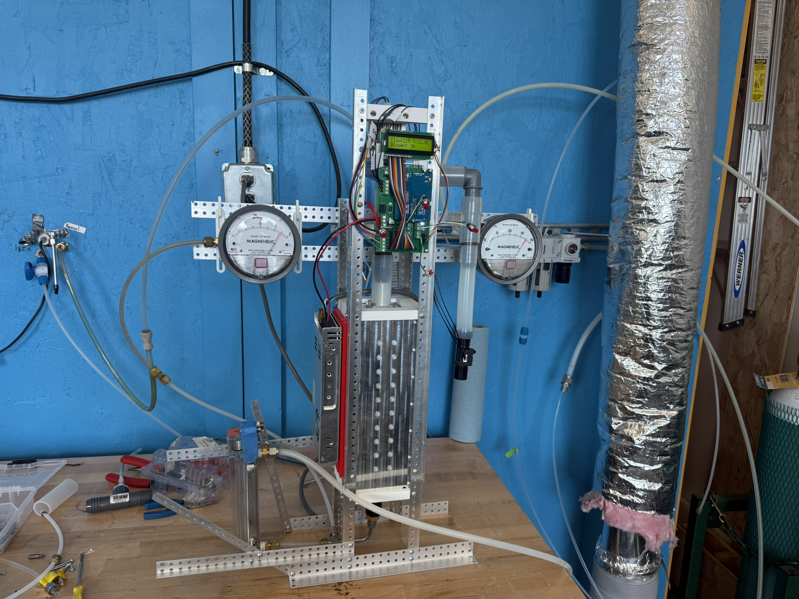
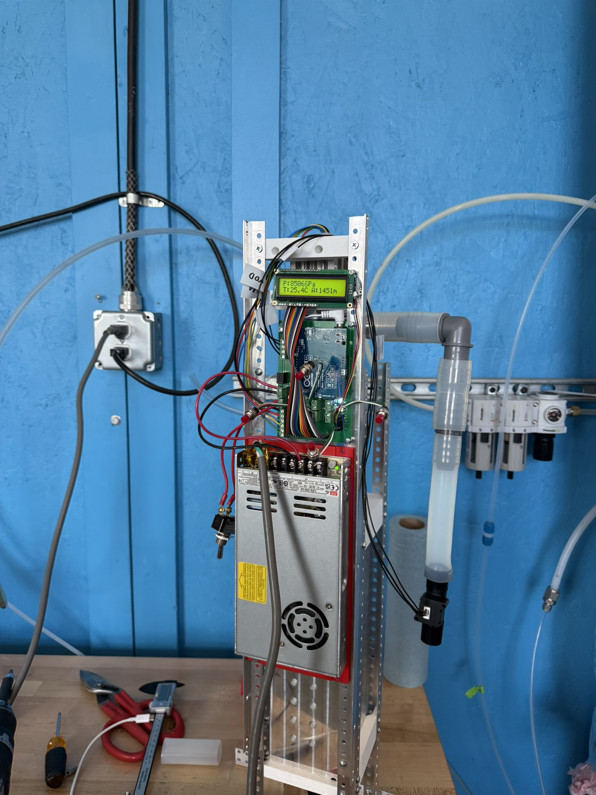
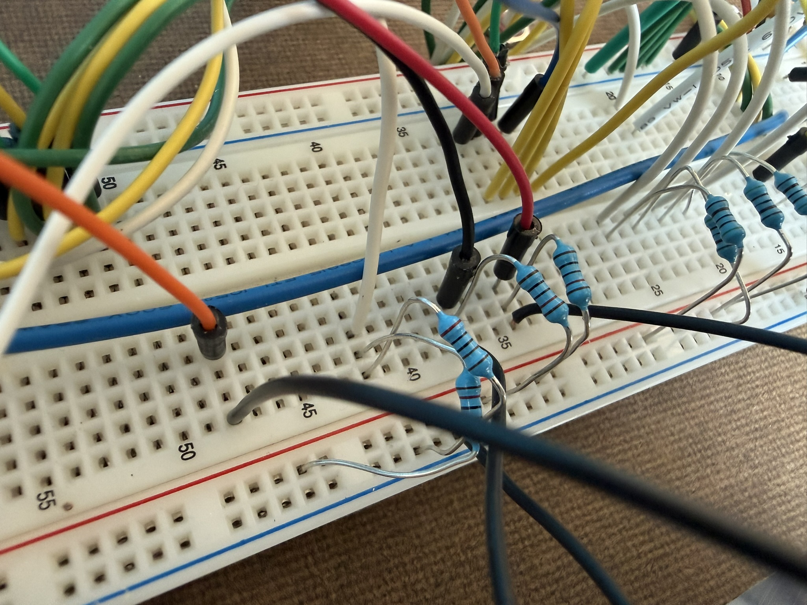
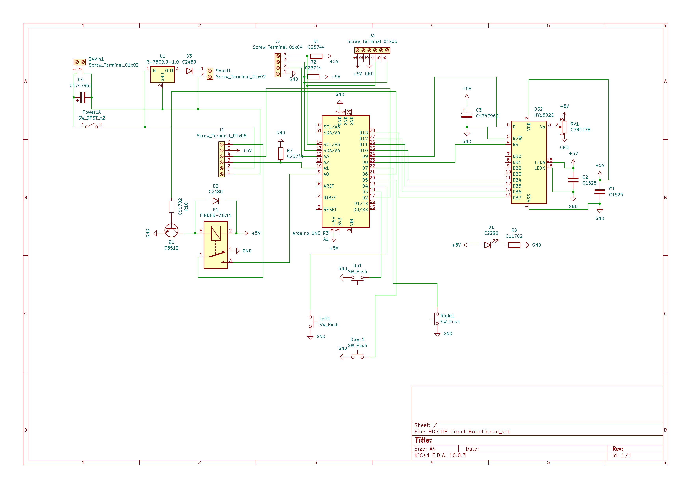
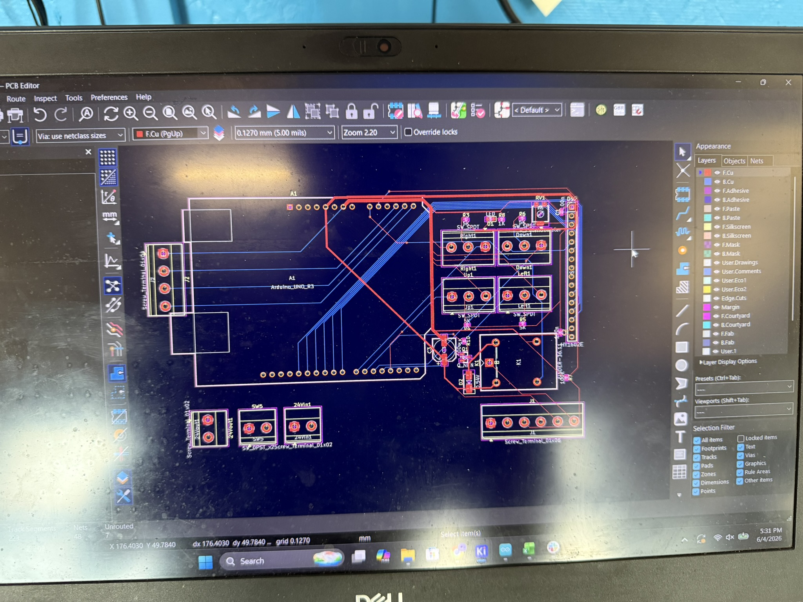
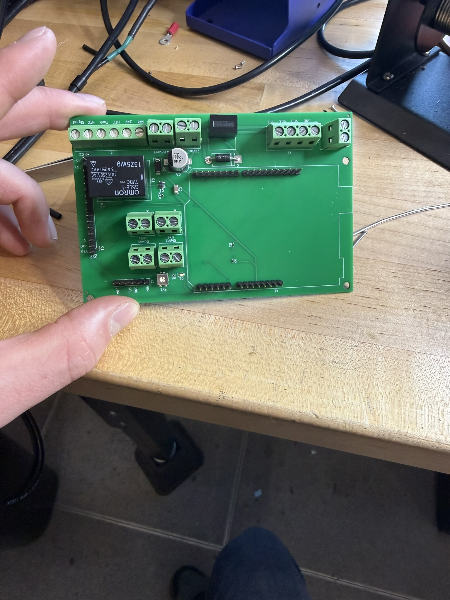
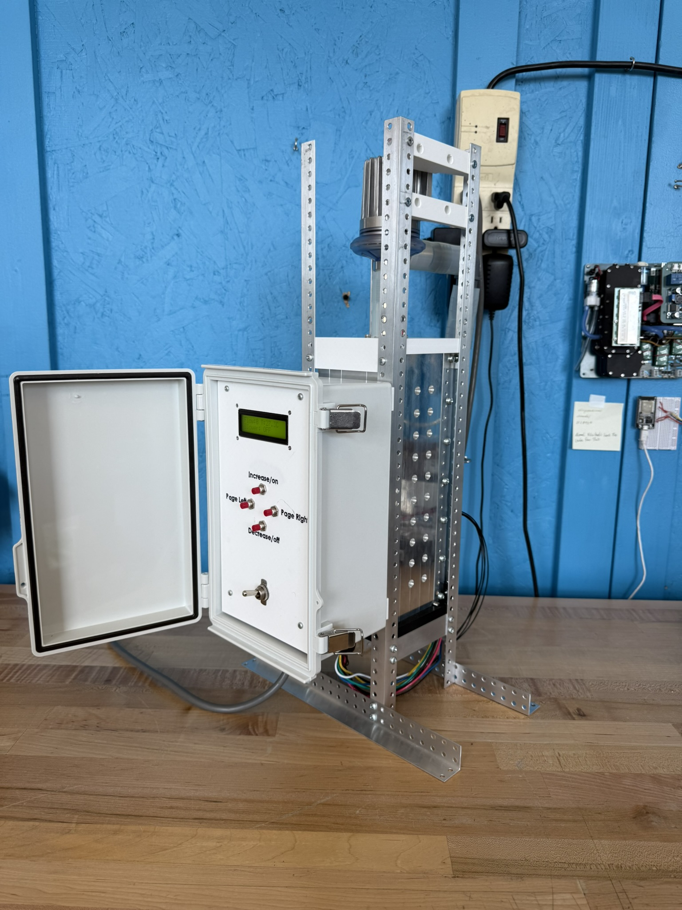

## The problem

The instrument is a **virtual impactor** — a high-flow-rate bioaerosol sampler
that separates particles by size using airflow rather than a physical filter
barrier, concentrating the fraction you care about into a smaller sample stream.

That separation depends on the flow rate being what you think it is. A virtual
impactor pulling 225 L/min is only cutting at the particle size it's designed for
while it's actually moving 225 L/min — and over a long outdoor run, filter
loading, temperature swings, and supply voltage sag all drag the real flow away
from the setpoint.

Set the flow once at the start of a run and you don't get a slightly worse
sample. You get a sample whose size cut drifted, taken at a flow rate you can no
longer state.

## The rig

The controller was developed against the instrument on a test stand, with flow
and pressure instrumentation in line so commanded flow could be compared against
measured flow.

## Electronics

I prototyped the sensing and control circuit on a breadboard first, then
committed it to a schematic and board layout.

The board was laid out in **KiCad** — a controller carrying the pressure and flow
sensor inputs, the drive output for the sampler, and the I²C and power
connections.

Then fabricated and populated: screw terminals for the sensor and tach lines, a
relay for switching the sampler, and headers for the controller and I²C bus.

Because the instrument runs outdoors, the electronics went into a **watertight
enclosure** rather than sitting exposed on the stand.

## The control loop

On top of that hardware I implemented and tuned a **PID feedback controller**
that reads live pressure and flow data and continuously corrects the flow rate,
rather than trusting an open-loop setting made once at the start of a run.

Tuning is where the work actually is. Too aggressive and the loop chases sensor
noise and hunts around the setpoint; too soft and it never catches a slow drift
from a loading filter — which is exactly the disturbance the loop exists to
reject.

## Result

The sampler holds its target flow rate in real time through changing conditions,
which keeps the size cut consistent and the collected samples comparable across
a run and between deployments.
