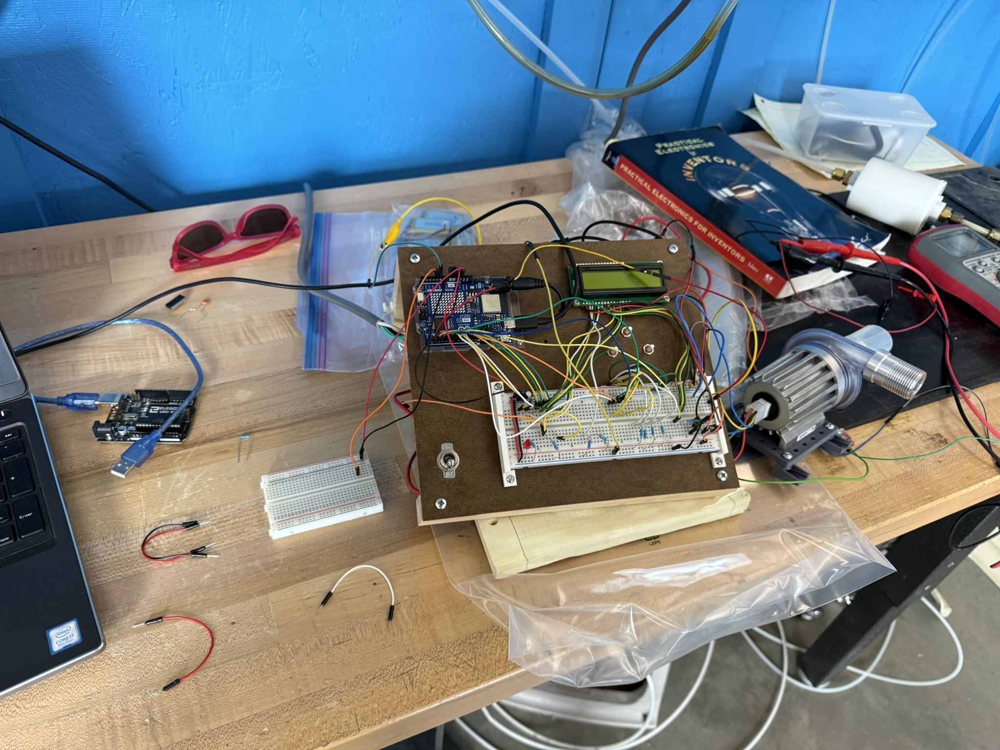
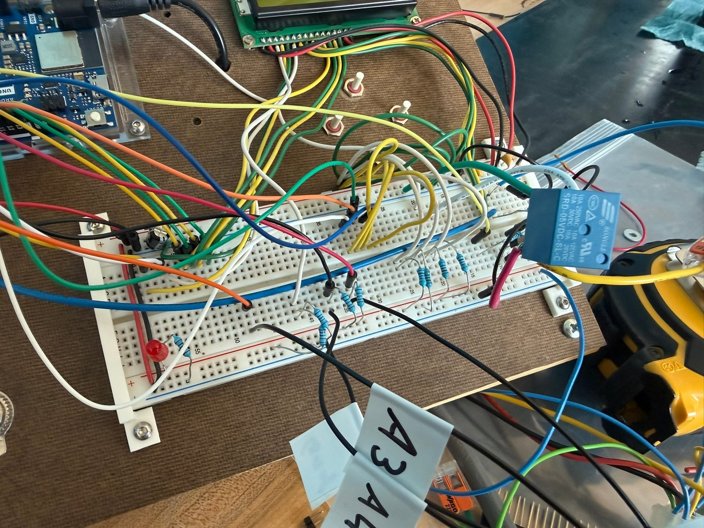
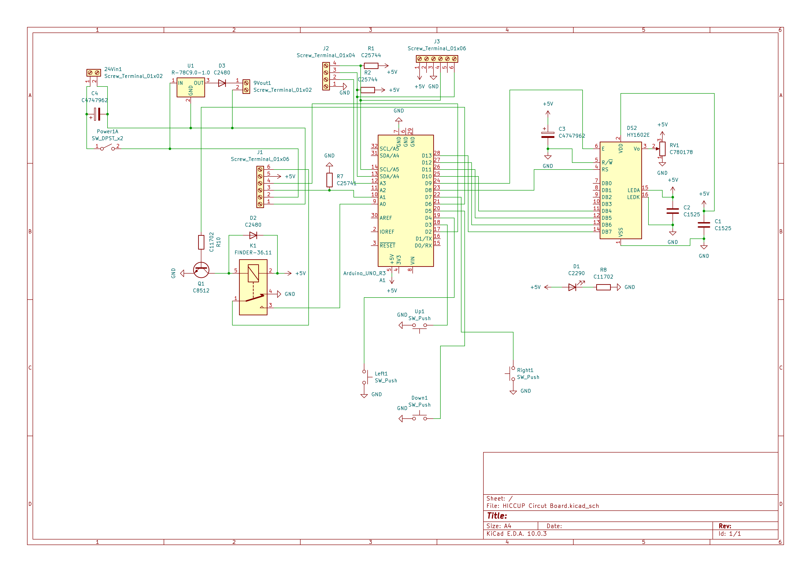
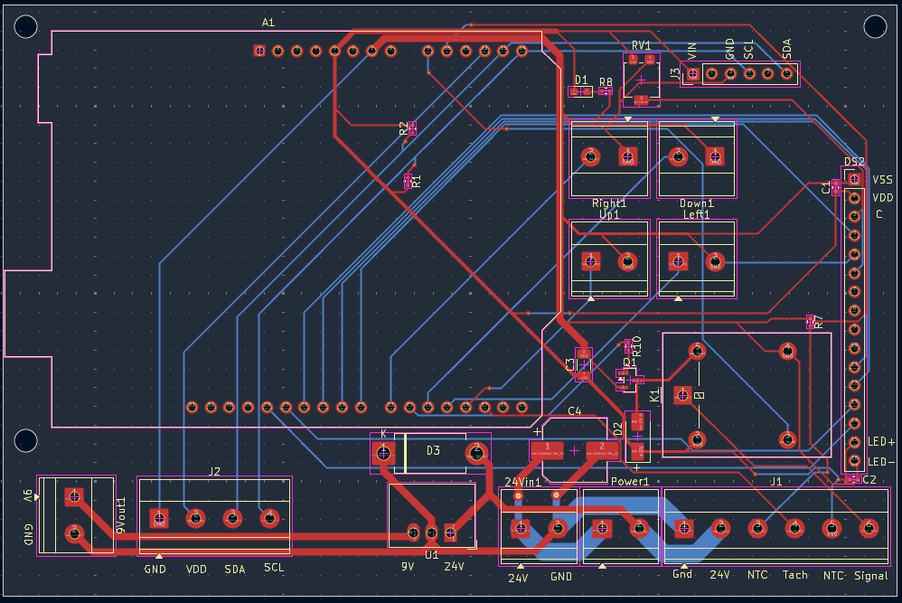
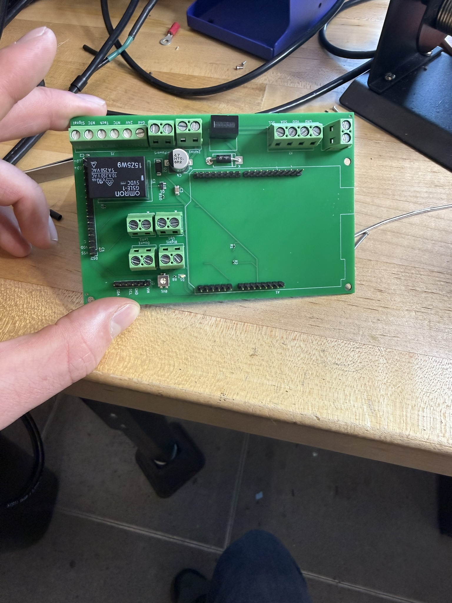
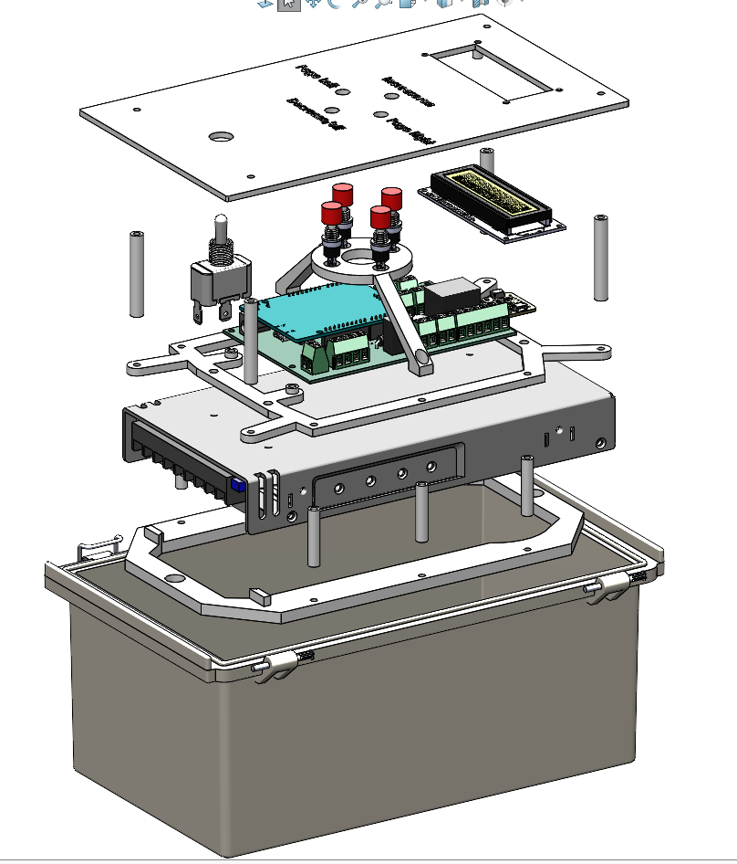
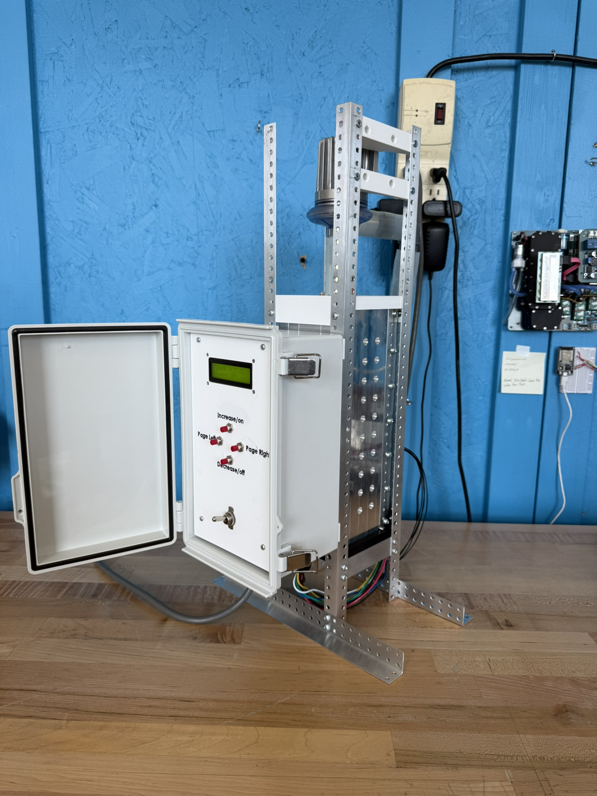
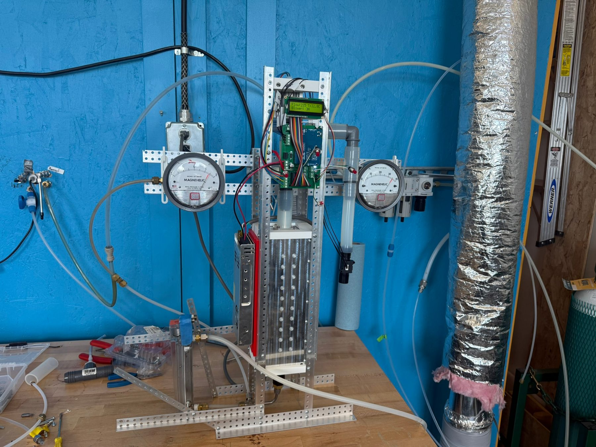
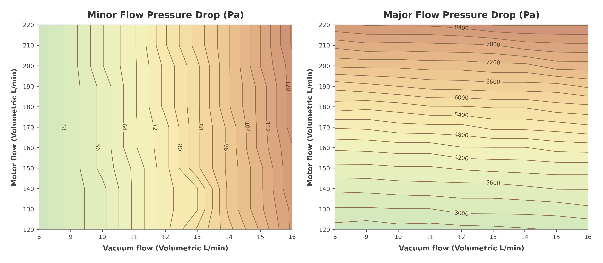
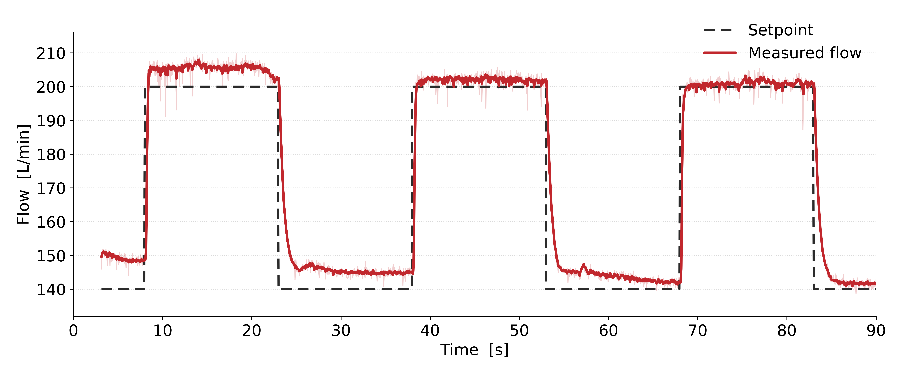

## The problem

After COVID-19 hit the world, humanity realized how little is known about organics in the atmosphere. It was through this discovery that my PI (principal investigator) built a virtual impactor to sample the air and broaden our understanding of the biosphere.

A virtual impactor uses complex airflow to concentrate particles from a large volume to a smaller one. In our system, these concentrated particles were then sent through a condensation sampler, which preserves the state of the organic material better than a filter-based sampler. In this way, we were able to increase both the sampling speed and the longevity of the organics we were sampling.

## Where I started

His design was clever, but it relied on a large number of electronic components compared to his previous, entirely analog designs.

He had designed a basic button-based controller that allowed you to manually set the voltage of the motor, but there was no feedback, and this sampler relied on knowing exactly how much air had passed through the impactor in order to function properly. This meant I had to integrate a flow sensor and a feedback controller into the system.

## Electronics

After working for a few weeks on the design and code, I had a breadboard with all the components required for the constraints we placed on this project.

With the circuit working, I continued by designing a circuit diagram that followed the layout I had made on the breadboard.

Next came the physical layout of the board. I chose to use KiCad, as it is a free, open-source program with a large amount of support and documentation. For my first PCB, it seemed like the perfect place to start.

The board condensed all the electronics on the breadboard into something that would fit in the palm of your hand. It had two separate power lines: a 24 V line for the motor and a 9 V line for the Arduino board logic. I learned so much about electronics and electronic principles through this experience, and I feel much more confident in my understanding of electricity because of it.

After designing the board, it was fabricated, populated, and tested. The design used screw terminals for the sensor and tach lines, a relay for controlling the sampler, and headers for the controller and I²C bus.

I then finished the firmware and integrated a pressure sensor to allow the board to function in a variety of environments.

Finally, I designed the enclosure for all of the electronics. This instrument needed to withstand hours of outdoor sampling, and even a tiny bit of moisture on the board would destroy the entire instrument.

I integrated the power supply, circuit board, buttons, screen, switch, and wires into a single PolyCase box, which was already rated for the conditions we would be placing the instrument in.

## Characterizing the instrument

Before sending the instrument out into the field, we wanted to ensure that the internal pressure drops would not be too extreme for the organic material we were trying to sample. I designed, set up, and ran a characterization experiment and gathered the results: the pressure drops were minimal, and the organics going through the system should survive.

These are the results. The largest pressure drop we saw was about 8,500 pascals, which is well within what the organics we are sampling can tolerate.

## The control loop

On top of that hardware, I implemented and tuned a PID feedback controller that reads live pressure and flow data and continuously corrects the flow rate, allowing us to know the exact volume of air we are sampling.

## Result

Step-testing the controller between roughly 140 and 200 L/min, the measured flow tracks the commanded setpoint, settles without sustained hunting, and holds there.

That plot is the whole point of the project. It means the sampler holds its target flow in real time through changing conditions, so we always know the volume of air we have sampled.

## What I learned

While there are many valuable engineering lessons from this project, the biggest for me was this: do not be afraid to make a mistake. I went into this project with essentially zero experience with circuit boards and electronics, and I walked out having made my own PCB that actually works. If I had not tried and failed countless times, none of this would have happened.

I went through multiple iterations of the PCB, each one after addressing a mistake I had made previously. The PID controller was difficult to make, program, and tune, but after hours of troubleshooting, I was able to make it work.

In short, I learned to fail this summer, and to learn from those failures. A mistake is just an opportunity for growth.
