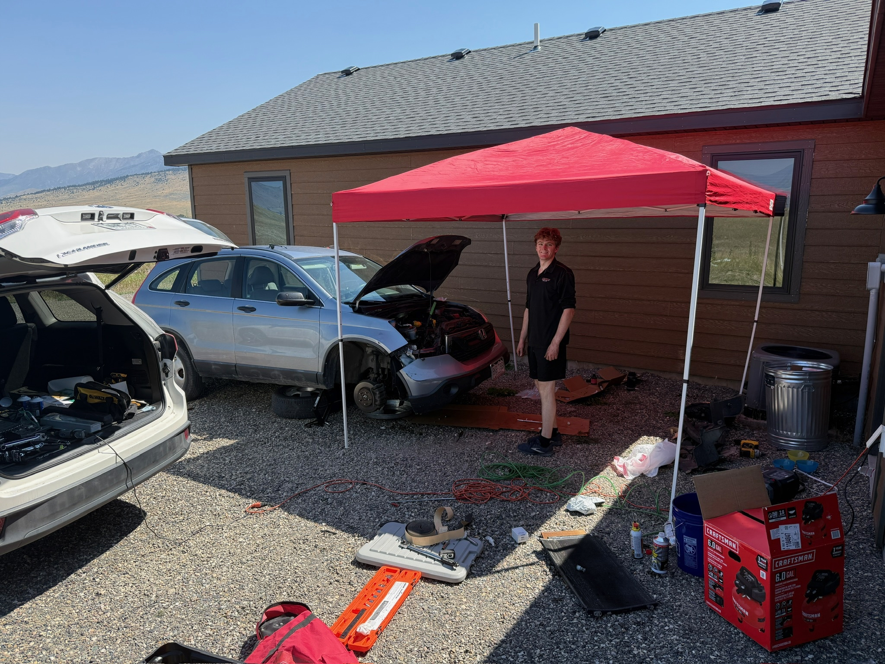
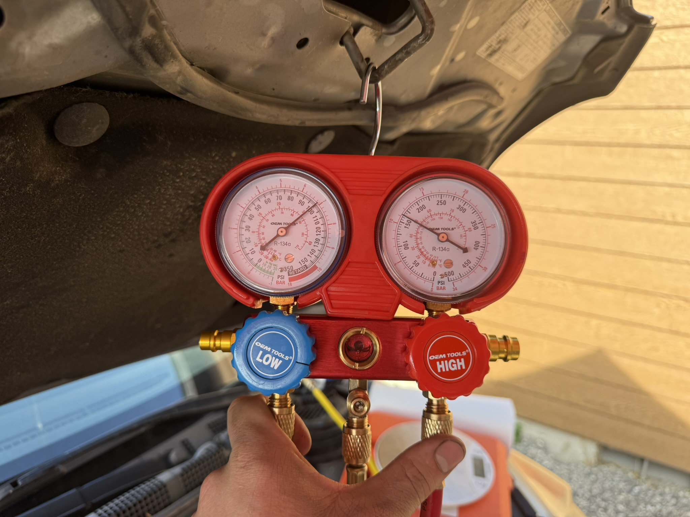

## The situation

My sister lives in Montana, and her car's air conditioning had quit blowing cold. A shop had
already diagnosed it: a leaking and failed compressor.

The hardest part of this project was logistics, not diagnosis. We were meeting her partway
through a family vacation, in a scenic part of the Montana, tens of miles away from where
she lives and hundreds away from my garage. Whatever the repair needed, it was
going to happen **in the driveway of a rental house**, in one morning, with only
the tools and supplies we brought with us from home.

Everything in that photo travelled across the country with is in our SUV.

## Finding the leak

Before doing the repair, I wanted to ensure that the compressor is what actually failed. The shop had said the leak was from the compressor intself, and I wanted to make sure it was actually the compressor that had broken, not a simple O-ring connection into the compressor. 

Before anything came apart, I put UV dye through the system and went over it
with a blacklight. Leaking dye fluoresces bright against everything around it,
and finding the leak becomes possible and easy.

It is hard to see in this picture, but there were parts of the compressor that were glowing green under the UV light. I saw that the leak was coming from the seals within the compressor, and I knew the whole thing had to be replaced.

## The repair

Compressor, expansion valve, and condenser, then a flush to clear debris the
failed compressor had pushed through the system. Skipping the flush just feeds
the old failure into the new parts — an expensive way to do the job twice.

## Recharging by weight

This is the step that gets done wrong most often. An A/C system takes a
*specified mass* of refrigerant, not "however much it takes until the pressure
looks about right." Charging by gauge pressure alone is guessing, and both over-
and undercharging cost you cooling performance.

So the system got evacuated through a manifold set and charged back on a scale,
tracking mass in against the spec.

## Result

Working A/C, finished in a morning, done before the rest of the vacation started.

The engineering lesson wasn't really about refrigeration — it was that when you
can't iterate, the planning *is* the work. Every decision that mattered was made
at home, packing the car, days before I saw the vehicle. That's a constraint I'd
never had before: no second attempt, no parts store, no bailout.

The refrigeration knowledge was a bonus. I'd watched pressure and temperature
change across each stage of the vapor-compression cycle with a gauge set in my
hand well before I saw it drawn on a P–h diagram in class.
