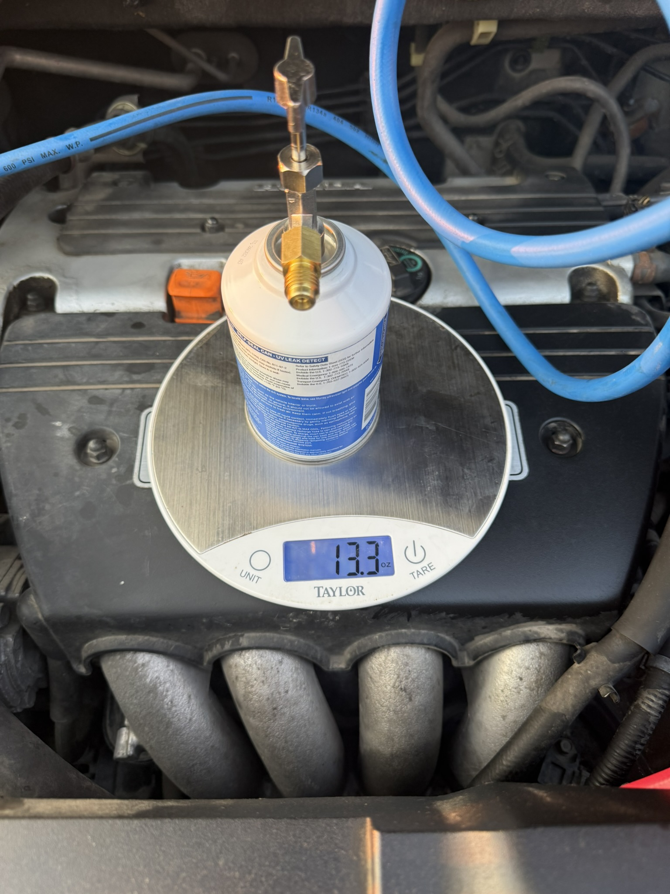

## The problem

An A/C system that isn't cooling. The symptom is simple; the cause usually
isn't. A low charge is a *consequence*, not a root cause — refrigerant isn't
consumed, so if there's less of it than there should be, it went somewhere.
Topping it up without finding out where just buys you a few weeks.

## Finding the leak

I read the system first with a manifold gauge set. Low and high side pressures
together tell you a lot about what's actually wrong — whether you're low on
charge, blocked, or the compressor isn't doing its job.

Pressures narrow it down, but they don't tell you *where*. For that I put UV dye
into the system and went over it with a blacklight. Under UV the escaped dye
fluoresces bright against everything around it — the leak stops being a theory
and becomes a spot you can point at.

## The repair

With the leak confirmed I replaced the **compressor**, **expansion valve**, and
**condenser**, then flushed the system to clear debris left behind by the failed
components — skipping that step just feeds the old failure into the new parts.

## Recharging by weight

This is the step people get wrong. An A/C system takes a *specified mass* of
refrigerant, not "however much it takes until the pressure looks right." Charging
by gauge pressure alone is guessing, and both overcharging and undercharging hurt
cooling performance.

So I pulled the system down and charged it back on a scale, tracking the mass
going in against the spec.

## Result

A working A/C system, and a hands-on feel for the vapor-compression cycle that
has made the thermodynamics coursework far less abstract — I'd already watched
pressure and temperature change across each stage of the cycle with a gauge set
in my hand before I ever saw it drawn on a P–h diagram.
