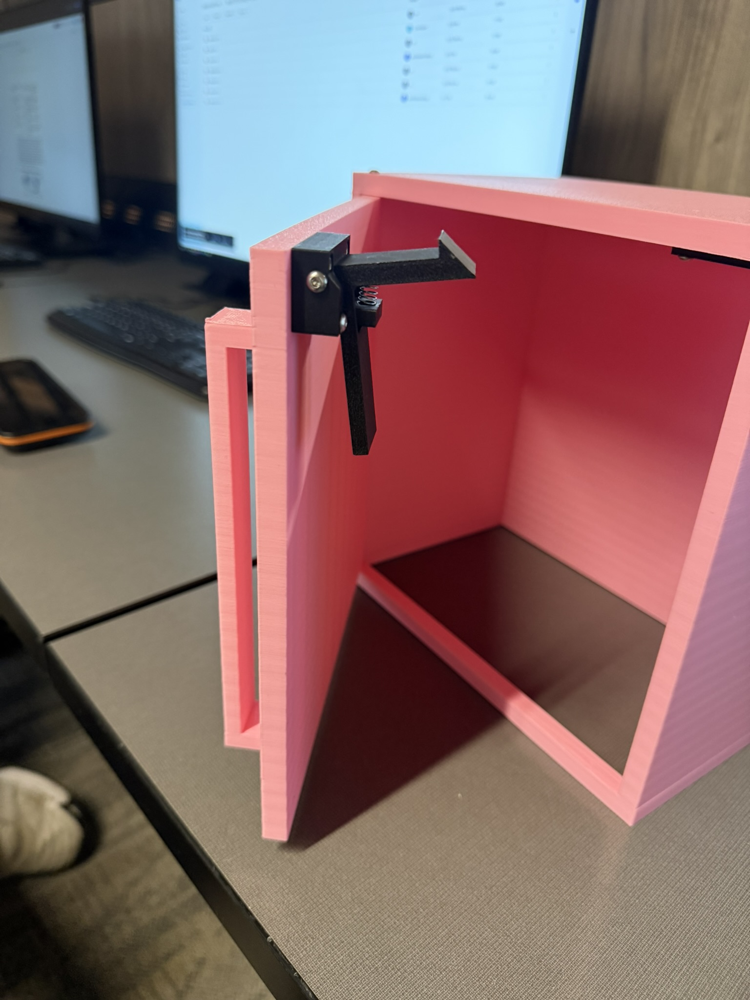
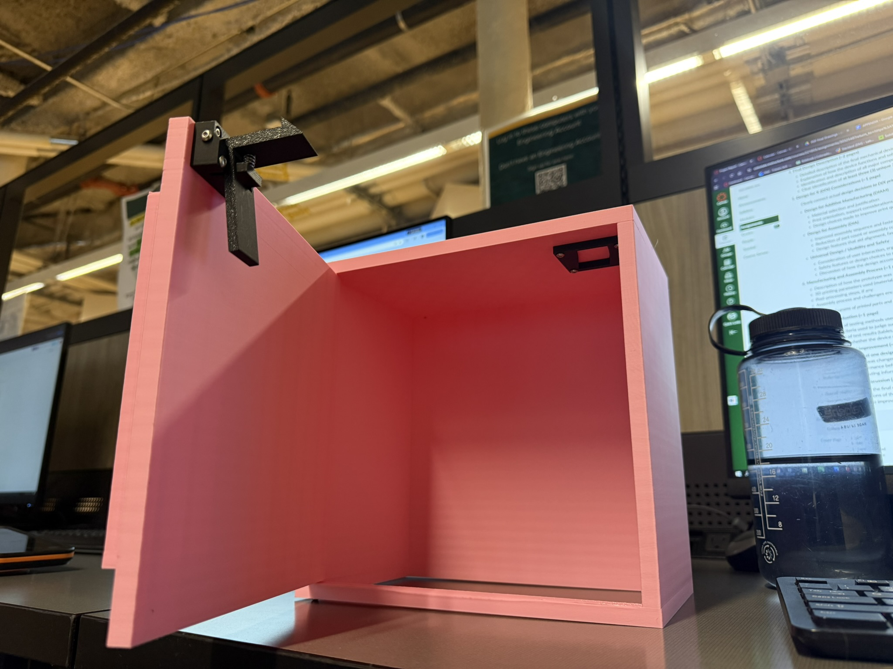

## The problem

Households store cleaning chemicals, medications, and sharp objects in cabinets a
small child can open. Commercial child locks exist, but they tend to need awkward
installation or make daily access annoying enough that adults stop using them.

The design has to sit between two opposing requirements: **resist a child**, and
**stay convenient for an adult**. Anything you make harder to defeat, you usually
also make harder to live with — and a lock people disable because it's irritating
protects nobody.

We added a third constraint on top: it had to be manufacturable by **FDM 3D
printing**, whose material and tolerance limits shape what mechanisms are even
available to you.

## How it works

The mechanism is a **one-way latch** with three printed parts and one
off-the-shelf spring.

- **Insert latch plate** — mounts to the cabinet frame. An angled face lets the
  trigger ride over it on closing; a flat face blocks reverse motion once engaged.
- **Holder housing** — mounts to the door, constrains the trigger arm's motion,
  and keeps it aligned with the latch plate.
- **Trigger arm** — pivots inside the housing, held in its engaged position by
  the spring.

Closing the door pushes the trigger over the angled face of the latch plate,
deflecting it; once past, the spring returns it and the cabinet is locked. **No
user action is required to lock it** — it's passive. Opening requires deliberately
pulling the trigger against the spring to clear the latch.

Child resistance comes from that trigger being placed internally and needing an
intentional pull, not from brute stiffness. Making the spring stronger would
resist a child better and annoy an adult in exactly the same proportion.

## Designing for the printer

A few decisions came straight from the manufacturing constraint:

**The spring is not printed.** FDM printers make poor springs, and this mechanism
depends on a consistent restoring force through thousands of cycles. Using an
off-the-shelf spring was a deliberate trade: one non-printed part in exchange for
force consistency and durability the printer can't deliver.

**Parts were oriented flat on the bed** to maximise bed contact and improve
dimensional accuracy on the mounting and interface surfaces, and the trigger arm
was oriented so its load runs along the print layers rather than across them —
FDM parts split between layers long before they break along one.

**Supports were required** for the trigger arm's overhang and the spring seat
cavity. That costs material and post-processing, but printing those features
unsupported would have lost the dimensional accuracy the mechanism needs.

**Tolerances were opened up** between moving parts to absorb printer variability
without hand-fitting every assembly.

Printed on a Bambu Lab P1S in PLA at 0.16 mm layers, gyroid infill at 25%, three
perimeters. Total print time: one hour.

## Testing

| Requirement | Test | Result |
| --- | --- | --- |
| Automatic locking | Close the door | **Pass** — locks every time, no user input |
| Resists unintentional force | Sharp, forceful pull on the handle | **Pass** — stayed closed |
| Child resistance | 8 lb sustained pull | **Pass** — held |
| Durability | Open/close continuously for 5 minutes | **Pass** — latched every cycle |
| Low cost | Under $1 in material | **Pass** — 18.29 g of PLA, ~$0.37 |
| Ease of manufacture | Under 1 hour print | **Pass** — exactly 1 hour |
| Ease of assembly | Under 5 minutes to install | **Pass** |
| Fits different cabinets | Install on several cabinets | **Fail** — only fits the custom test cabinet |

That last row is the honest result. We built and validated against a printed test
cabinet because we didn't have access to real ones, so "works on any cabinet"
went untested and, as designed, untrue. The mounting geometry is specific to the
box we made.

## What I'd change

Assembly kept fighting us in one specific place: the spring wants to unseat
before the trigger arm is fully inserted. We worked around it by compressing the
spring by hand and entering the trigger at an angle — a technique, not a design.
The right fix is a **retaining tab in the housing** to hold the spring during
assembly.

More broadly, the mechanism's performance is sensitive to alignment between the
latch plate and trigger, which means it's sensitive to how carefully someone
installs it. For a product intended for non-technical users in their own kitchen,
that sensitivity is the real weakness — more than any material or strength limit.
