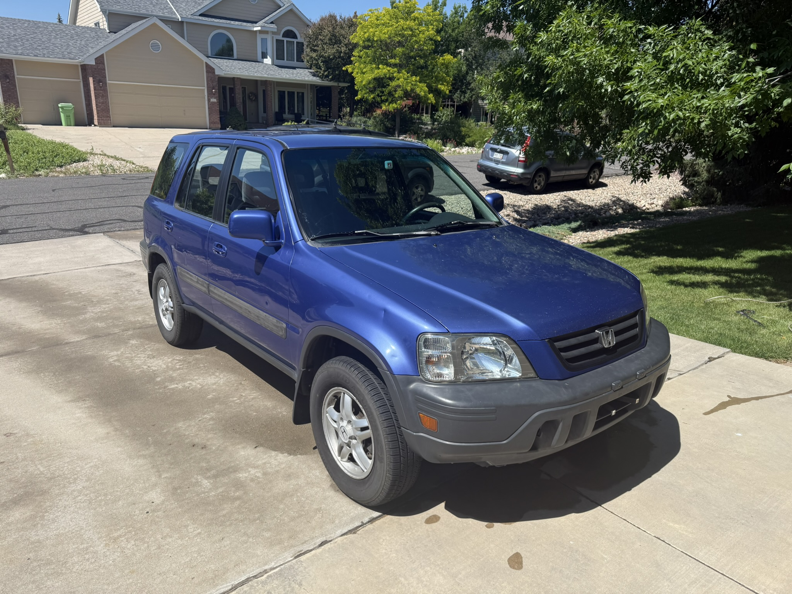
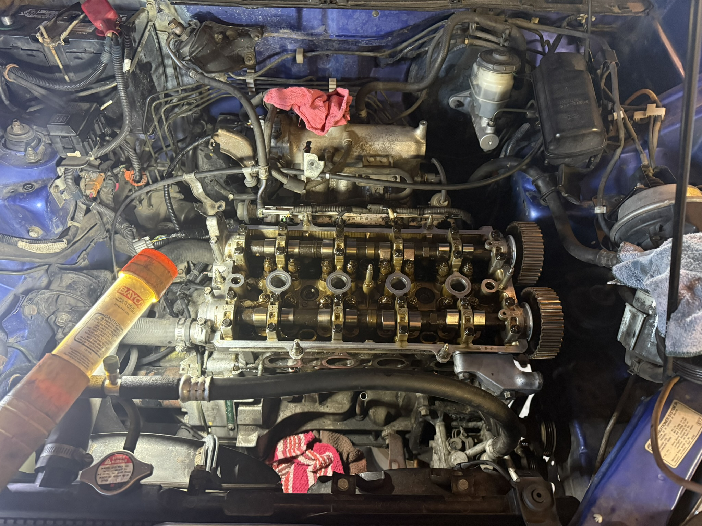
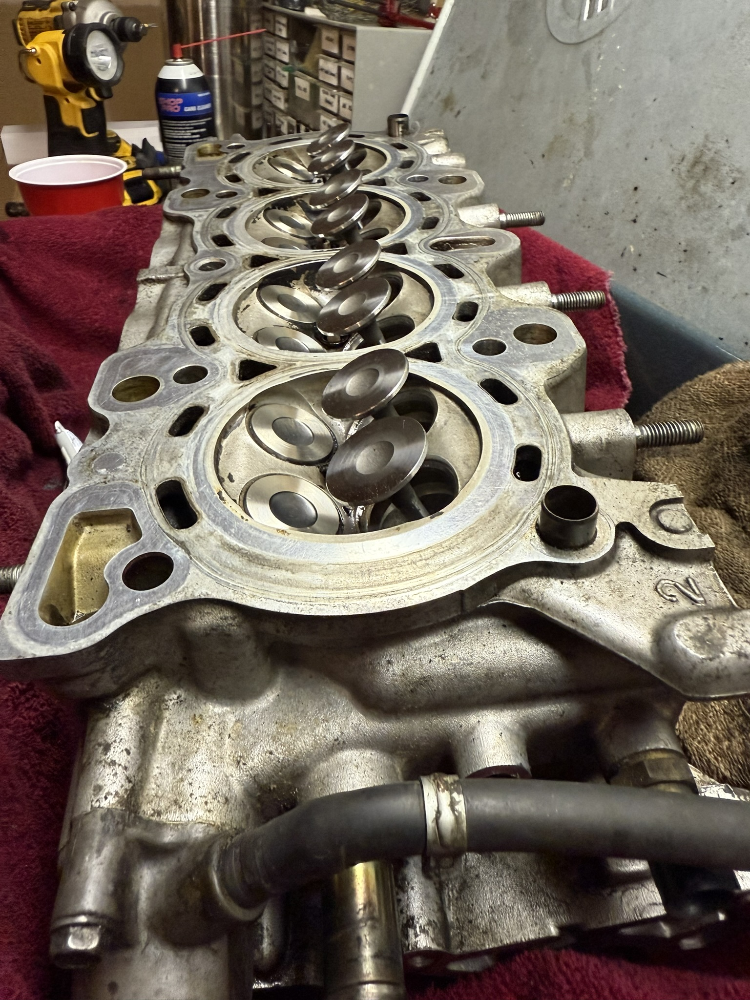
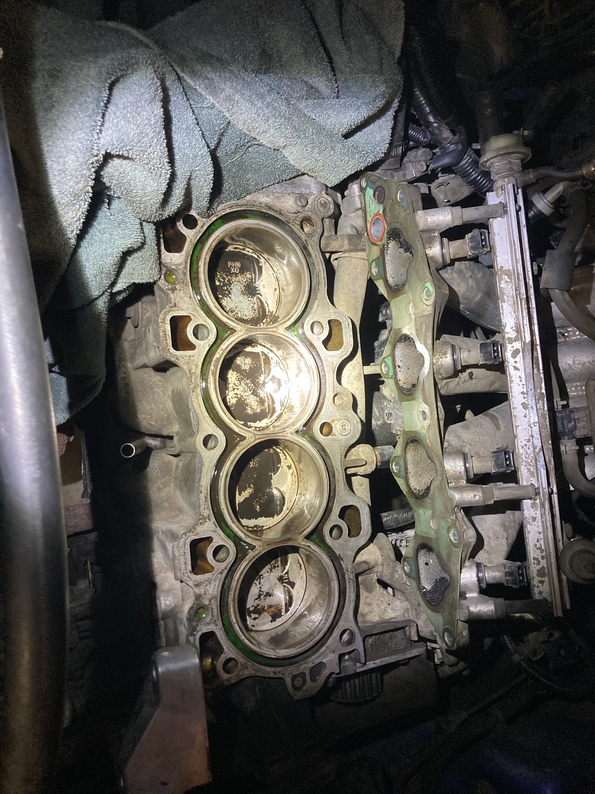
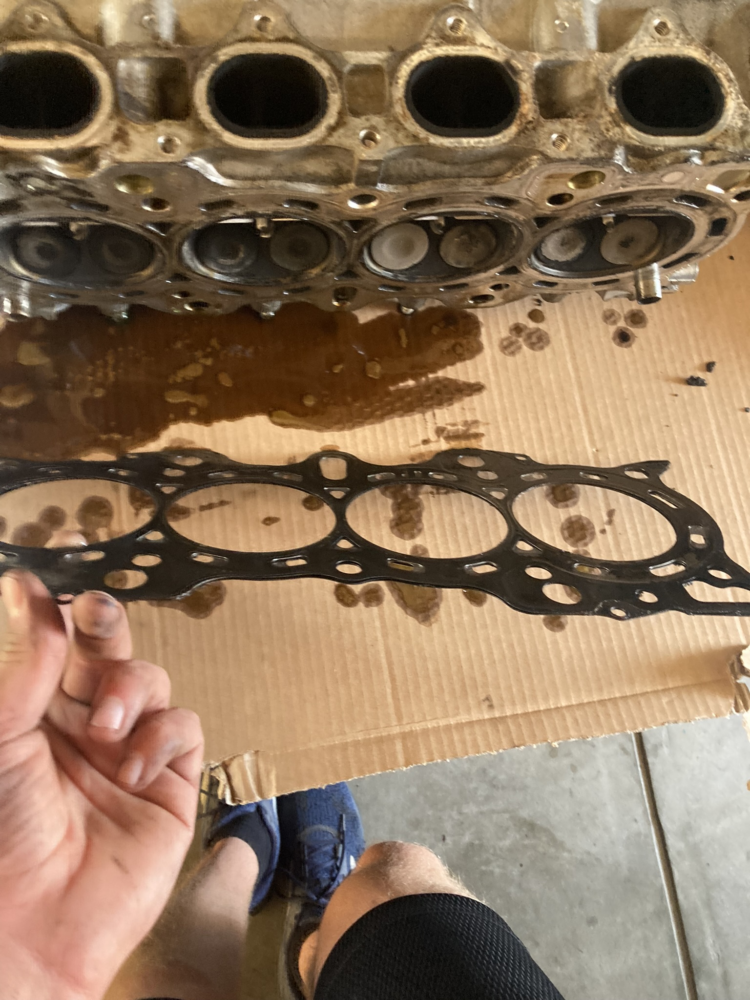
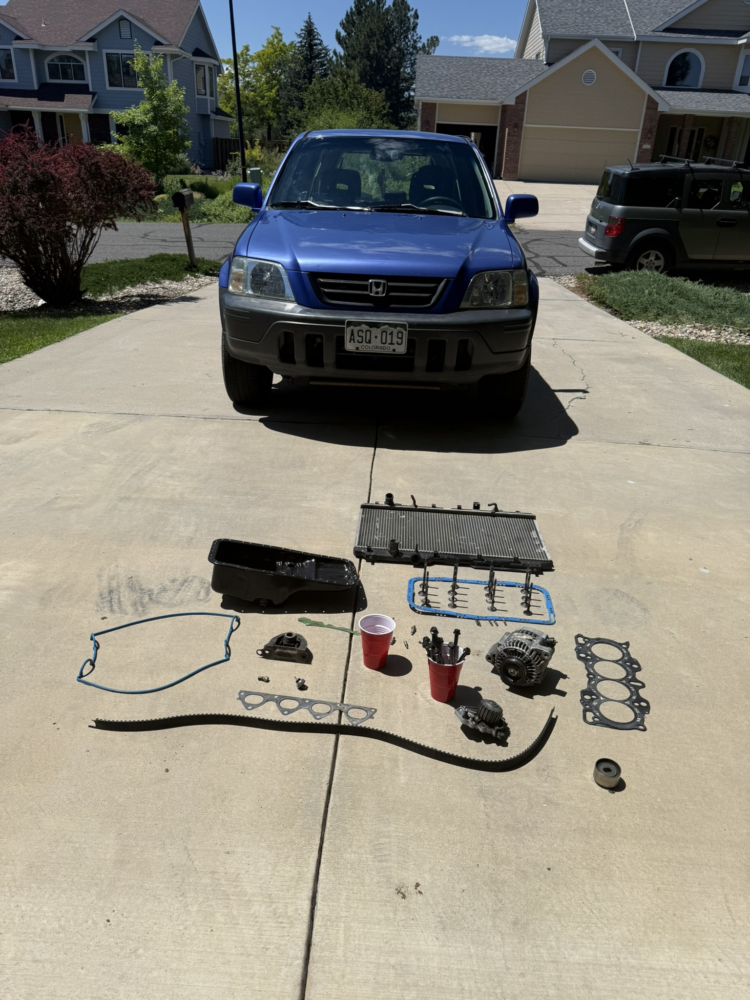
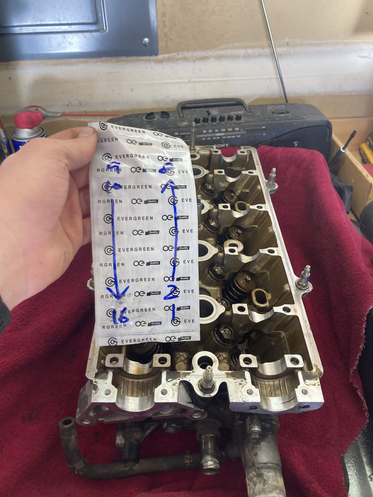

## The problem

A timing belt is the only thing keeping the camshafts in phase with the
crankshaft. On an interference engine — which the CR-V's is — that phasing is
also the only thing keeping the valves out of the pistons. When the belt let go,
the pistons kept moving and the valves didn't, and they met.

The result was bent valves and a cylinder head that had to come off.

## Teardown

Getting the head off meant working down through the timing components, intake,
and exhaust connections in the right order and keeping track of what came from
where.

With the head off, the block tells you how bad it was. Witness marks on the
piston crowns show exactly where the valves made contact.

The head gasket comes off with it — and its condition is worth reading before
you throw it away, since it records how the head and block were sealing.

Laid out on the driveway, the scope of the job is easier to see than to
describe — timing components, valve cover, intake, oil pan, and the full gasket
set, all of which has to come off and go back on in the right order.

## Keeping track

A cylinder head comes apart into a lot of small parts that are *almost*
identical, and every valve, spring, retainer, and keeper needs to go back into
the bore it came out of. Parts that look interchangeable aren't — they've worn
together.

I laid the components out in bore order and labelled them as they came off, so
reassembly was a matter of reading the map instead of guessing.

## Result

A running engine, reassembled and back in the car over a single winter while
carrying coursework and a part-time job.

The lasting lesson was about sequence. Timing work is unforgiving about order,
and there's no step you can skip because it's late and you're tired of the job.
Everything you rush at the front of a teardown, you pay for at the back of the
reassembly.
