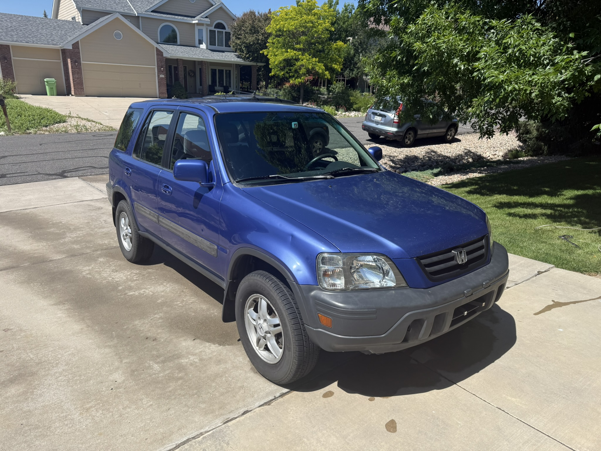
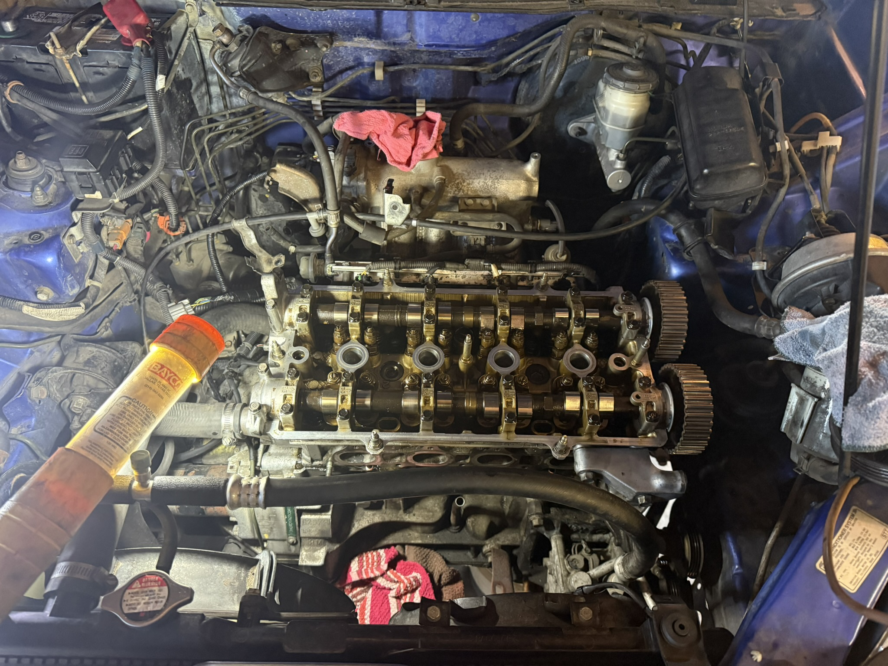
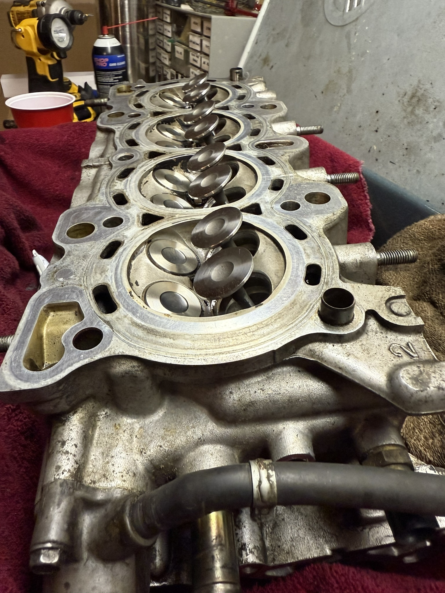
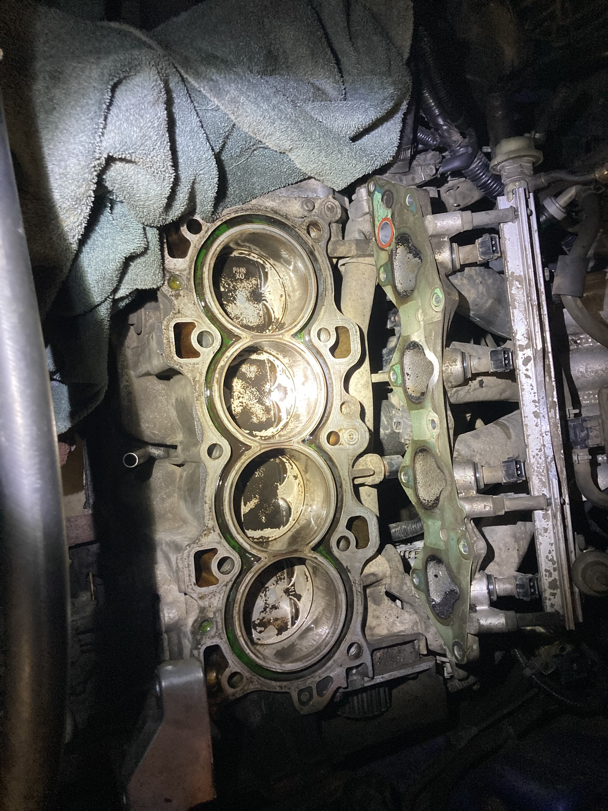
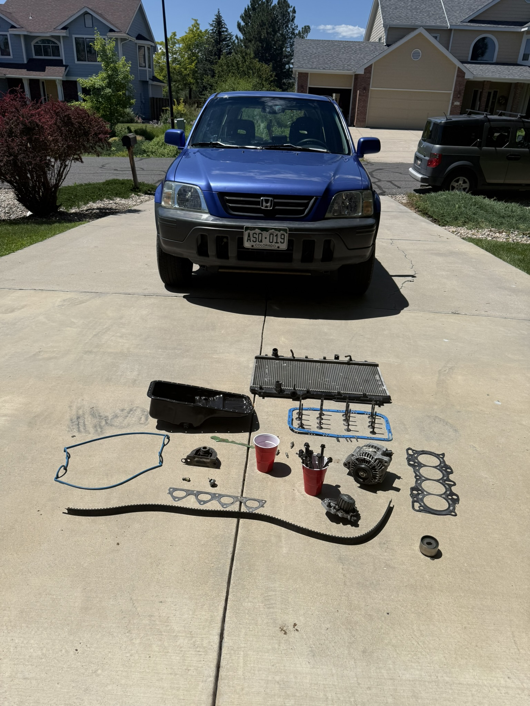
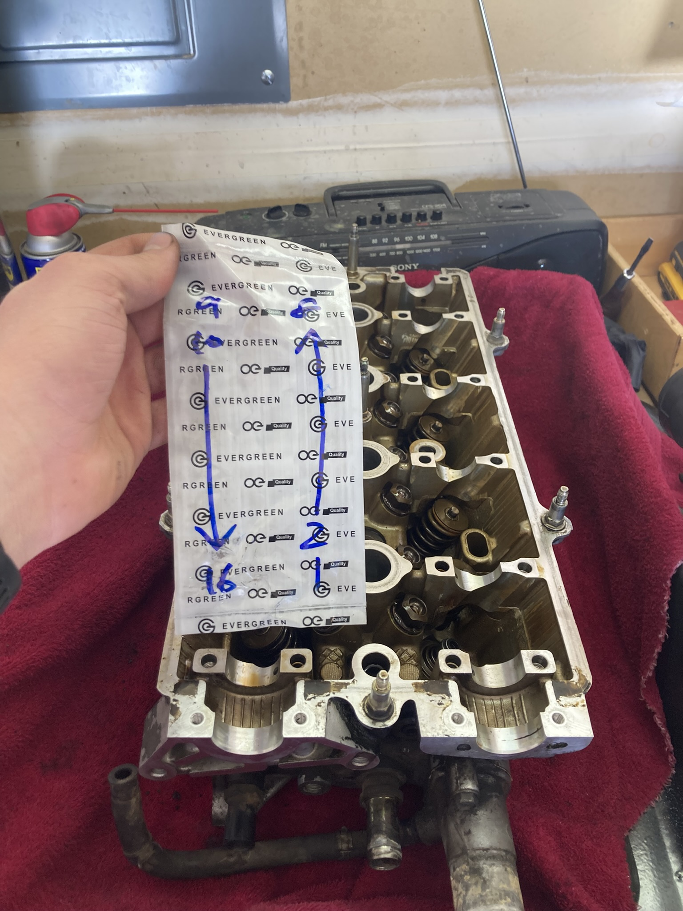

## The problem

One afternoon, while driving home from cross-country practice, my car suddenly shut off. I pulled off the road and had it towed to a shop, where they diagnosed a snapped timing belt. They quoted me thousands of dollars and told me the valves were bent and the car was totaled. I had done some simple repairs before, so I decided this was the perfect opportunity to deepen my mechanical skills and my understanding of engines by rebuilding the top end myself.

## Teardown

This was unlike any project I had ever done before. Being meticulous and detail-oriented was the name of the game, as a single lost bolt or incorrect torque spec meant the engine would not work.

With the head off, I got to take a close look at the pistons of my engine, as well as the cooling orifices, port injectors, and intake system. It was during this time that I developed a love for engines.

Laid out on the driveway, the scope of the project becomes apparent.

## Keeping track

A cylinder head comes apart into a lot of small parts that are almost identical, and every valve, spring, retainer, and bolt needs to go back into the location it came out of. Parts that look interchangeable aren't: they have specific wear patterns that match only their previous location.

## Result

Hours of work and hundreds (not thousands) of dollars later, my car ran better than the day I bought it.

I learned so much about engineering through this project, and I have found places to apply it in my classes time and time again. Airflow, heat dissipation, compression, fluids, and electricity were all things I dug deep into for this project, and I came out the other side with a strong understanding of all of them before attending a single college class.
