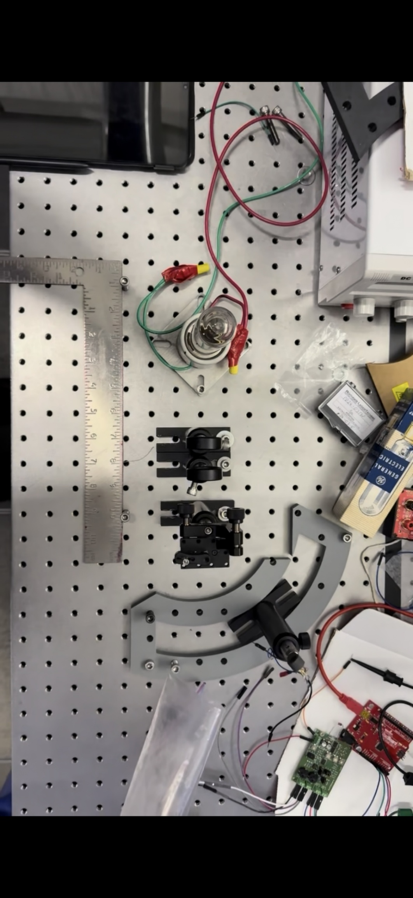
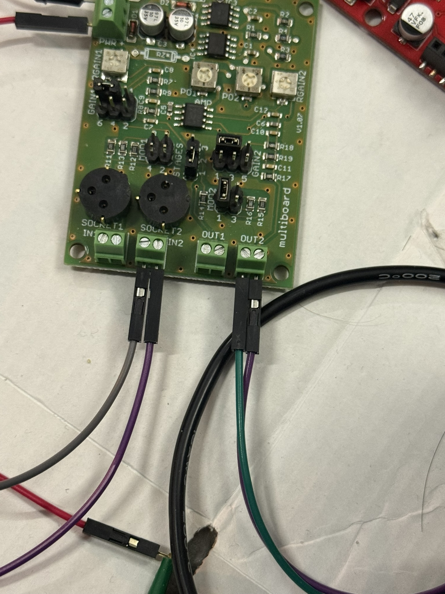
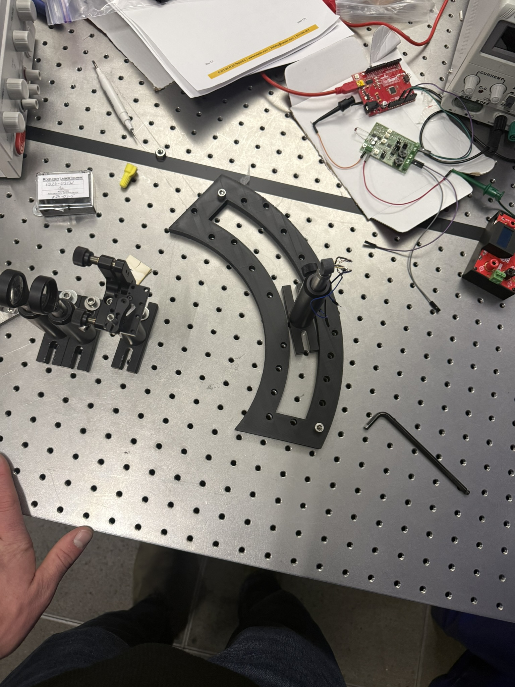
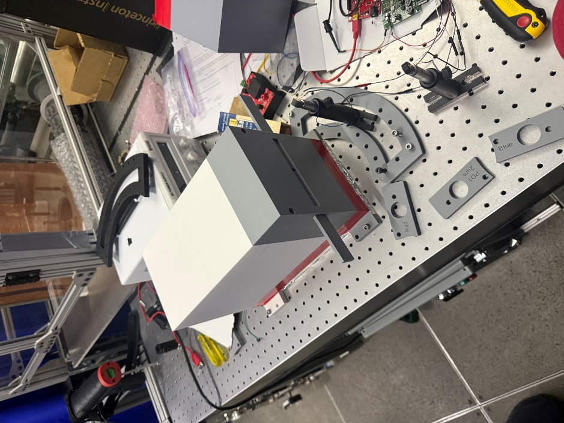
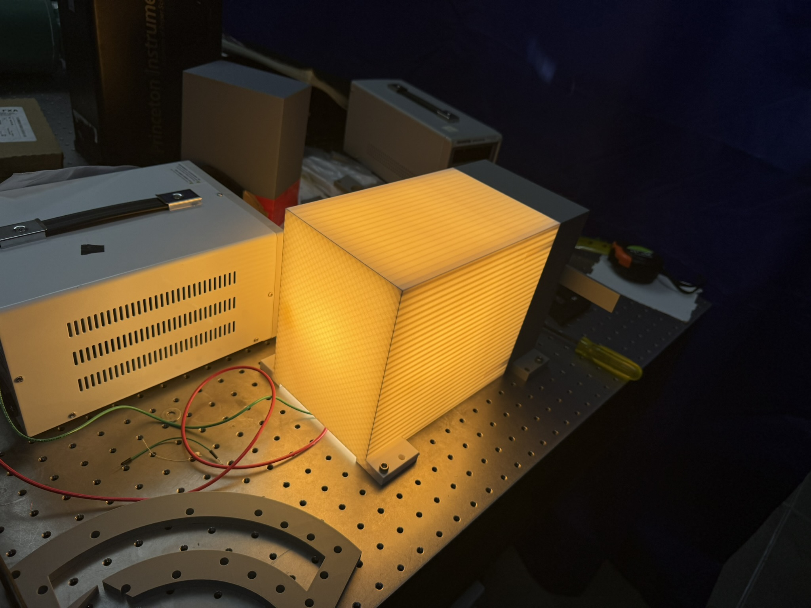
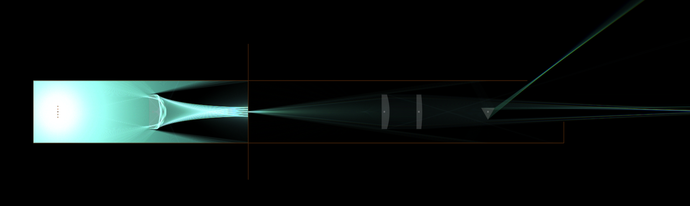
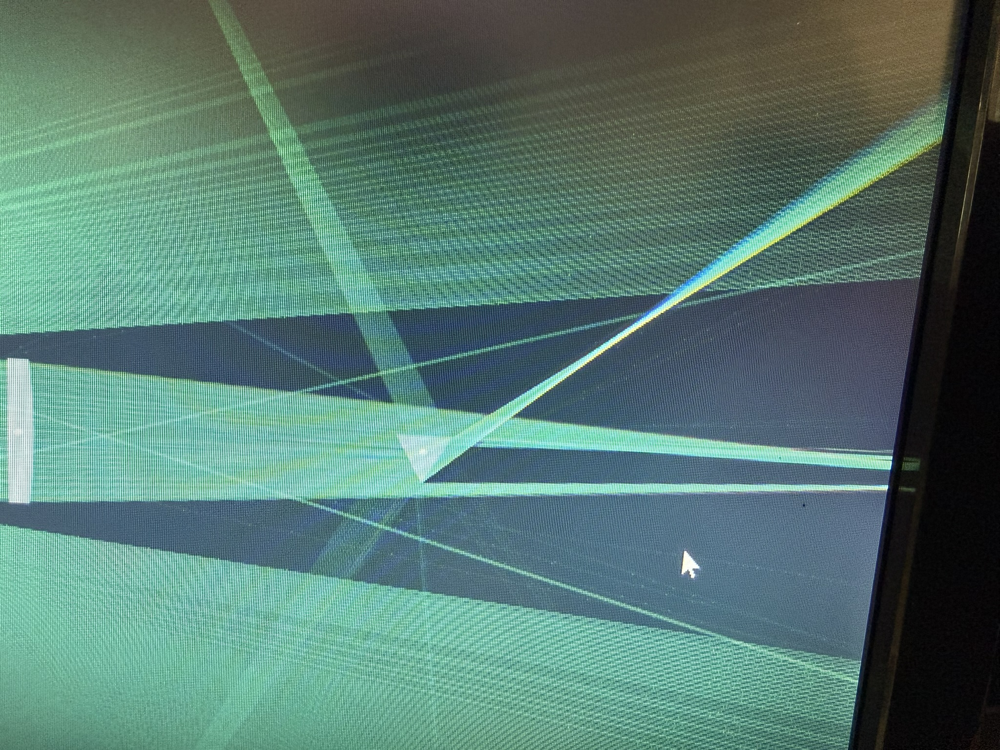

## The problem

Wildfires emit enormous quantities of soot, ash, and greenhouse gases, and for
**smaller** fires — vehicle burns, prescribed burns, house fires — the amount is
largely unquantified.

**Fire Radiative Power (FRP)** is the way to get at it. FRP measures the radiated
power of a fire in W/m², and it corresponds directly to how much that fire is
emitting. Measure FRP and you can estimate emissions.

The instrument that measures it is a **two-colour pyrometer**: it reads the same
source at two different infrared wavelengths and uses the *ratio* between them to
infer temperature. Working from a ratio is the point — it cancels out much of
what would otherwise wreck the measurement, including how much of the sensor's
field of view the fire actually fills.

The target was a **handheld unit under $1000**, because the existing options
either don't measure at the wavelengths these fires need or cost far too much to
deploy widely.

## The optical chain

An IR source passes through two lenses onto a prism, which disperses the light
into its wavelengths, and a photodiode reads a chosen band. A prism was chosen
over optical filters because it's cheaper and simpler.

The photodiode produces current in the **nanoamp** range, far too small for a
microcontroller, so it feeds a Boston Electronics MultiBoard that drops it across
a resistance and amplifies the result into a 0–4 V signal an ESP32 or Arduino can
read.

## Debugging the sensor

For weeks the photodiode was useless. Instead of a response curve, the reading
climbed steadily to 4 V and sat there — saturated.

The cause turned out to be a wiring mistake with a very good disguise. The
detector package has six pins, and two of them belong to a thermoelectric cooler
rather than the photodiode. **We were reading the TEC.** A heated thermoelectric
element acts as a generator, so the "signal" genuinely was proportional to how
bright the bulb was — it just had nothing to do with the photodiode. Moving to
the correct anode and cathode pins fixed it.

That failure is worth recording precisely because every symptom looked like a
working sensor that merely needed calibrating, which is why it survived so long.

## Making the measurement repeatable

With the detector working, results still moved between sessions, because the
photodiode's distance from the lens was being set by hand each time.

I modelled and printed a **jig holding the photodiode exactly 250 mm from the
lens** regardless of how the assembly is handled. Dragging the diode through the
dispersed spectrum then produced a response curve matching the PD24 datasheet —
the sensor was finally doing what its documentation said it would.

The curved arc sweeps the photodiode through the spread-out light, so peak
response is found by measurement rather than assumed from calculation.

Stray light was a persistent problem — reflections off the breadboard and the
room reaching the detector by unintended paths. We enclosed the source in a
printed shield to block them, then lined it with foil once it became clear the
lamp was hot enough to threaten the **PLA** it was printed from.

## The finding that mattered

I built a ray-tracing simulation of the optical chain to check the geometry, and
it turned up something that changed how we understood the instrument.

Feed the model a beam of perfectly parallel rays and everything converges to a
point at 250 mm — the behaviour the design assumed. Feed it the *actual* source
and no such point appears. The light spreads into a **projected image of the
bulb's filament**.

I went back to the bench and found exactly the same thing: not a focused point,
but a picture of the filament.

The assumption underneath the design was wrong. **The rays leaving the first lens
are not parallel** — and they can't be, because a lens only collimates a true
point source sitting at its focal point. The filament has physical length, so
every part of it off that point focuses somewhere else.

This matters because the prism dispersion calculations all assumed a single ray
striking the prism face, so each wavelength would leave at a calculable angle. In
reality the prism receives a spread of filament images wider than the prism
itself, producing countless overlapping rays and making it effectively impossible
to say precisely where a given wavelength lands. The simulation also showed the
focal points shifting along the prism face, so the blue end of the spectrum
cannot be in focus on a flat plane at the same time as the red end.

And it gets *worse* in the field, not better: a forest fire is far larger than a
lamp filament and will essentially never sit at the first lens's focal point.

## Result

From bench measurements we were able to **map photodiode voltage against the
known temperature of the bulb and predict that temperature from voltage** — the
calibration the whole instrument depends on.

What remains is implementing the second photodiode — the "two colour" half, which
needs the exact diffraction angles the simulation showed are hard to pin down —
and condensing the bench into something portable.

The most valuable thing I take from it isn't the calibration. It's that a
simulation I built to check my geometry ended up disproving an assumption the
design was resting on, and the bench then confirmed it. Finding out *why*
something can't work the way you drew it is progress, even when it doesn't look
like it in a status update.
