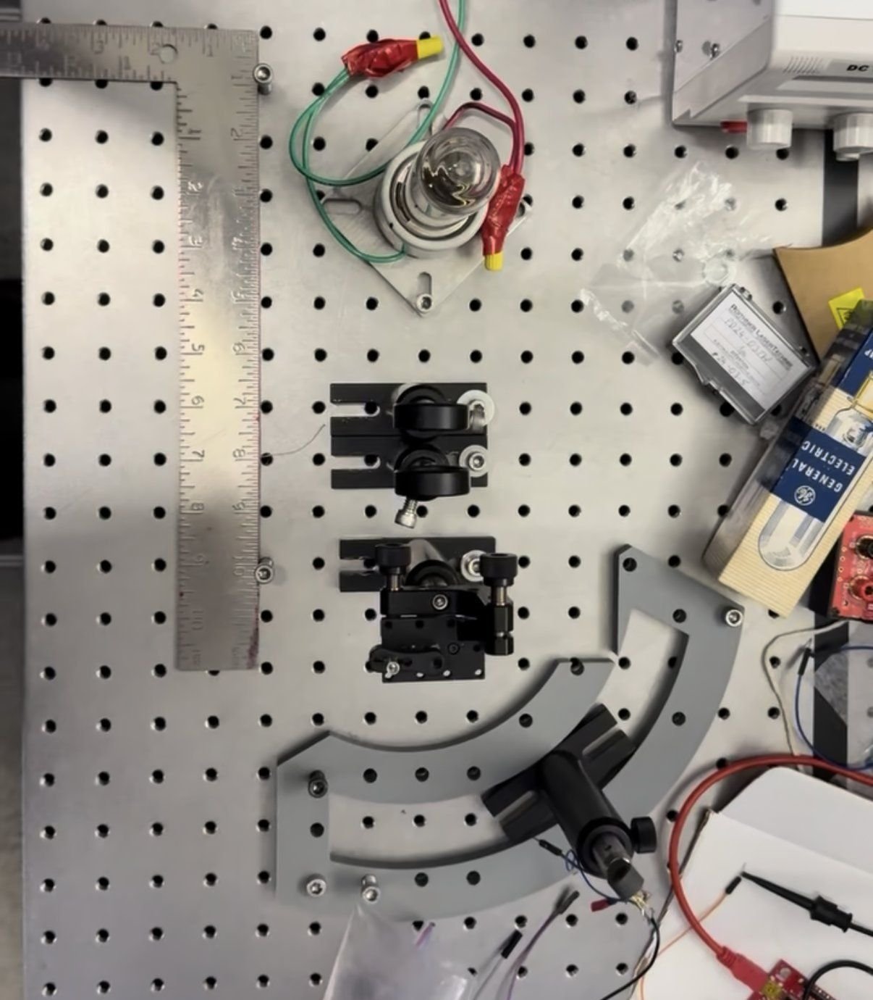
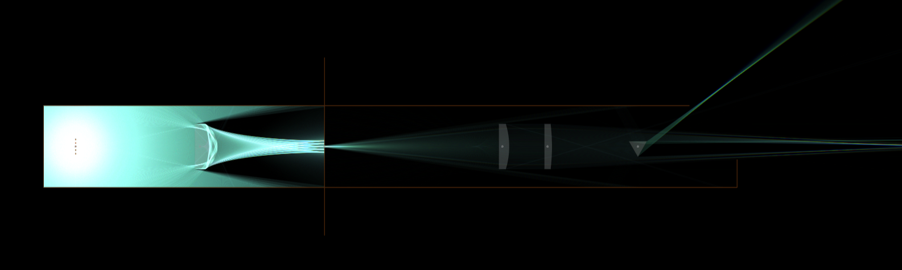

## The problem

Wildfires emit enormous quantities of soot, ash, and greenhouse gases. While the amount of each is well known for larger fires, it is generally unknown for smaller fires (prescribed burns, house fires, vehicle burns, etc.).

Fire Radiative Power (FRP) is the best way to estimate the emissions of these fires, as there is a known correlation between FRP and the biomass burned.

The instrument I was assigned to design is a two-color pyrometer. It reads the same source at two different wavelengths of infrared light and uses the ratio between them to calculate the FRP. It is far more reliable than single-color pyrometry, as it is much less easily swayed by the temperature of the air, smoke, or surroundings.

The target was a handheld unit under $1,000, because the existing options either don't measure at the wavelengths these fires need or cost far too much to deploy widely.

## The optical chain

My job was to design, over the course of a semester, a bench-top prototype to prove this was possible. The goal was to accurately calculate the temperature of an infrared bulb using two different photodiodes.

This was the setup: an infrared bulb shone light through two lenses, which focused it onto a prism that split the light into its various wavelengths. We would then place the photodiode at two separate points in this split light, based on its wavelength sensitivities, and calculate the ratio, and therefore the FRP, from those measurements.

## Prototyping in ray-tracing software

After weeks of troubleshooting and many issues and inconsistencies in the bench-top setup, I decided to build a ray-tracing simulation of the optical chain to check the geometry. This deepened my understanding of the problem and let me brainstorm potential solutions without buying expensive lenses or prisms.

After hours of talking with professors and working with the ray tracer, I finally found a solution that worked. The issue was that I had assumed the filament in the bulb was a point source, when in reality it was a large number of point sources placed next to each other over a 9 mm distance. By the time I understood that a third lens was required to counteract this, the semester was over and my project was done.

## What I learned

This was my first "real" engineering challenge in college, and I learned a great deal from it. Taking the time to understand the fundamentals is very important: jumping into a problem before understanding the physics is what sent me on a wild goose chase that wasted a large amount of time.

If I were to do this project over again, I would go about it very differently. I would start with a conceptual understanding of optical physics and sit down with a professor to walk through the physical constraints of this system. After that, I would design the bench-top setup in the optical simulator and prototype different configurations until I found one that worked. Finally, I would build it on the bench, knowing that the only issues I would encounter would have nothing to do with the optics.
