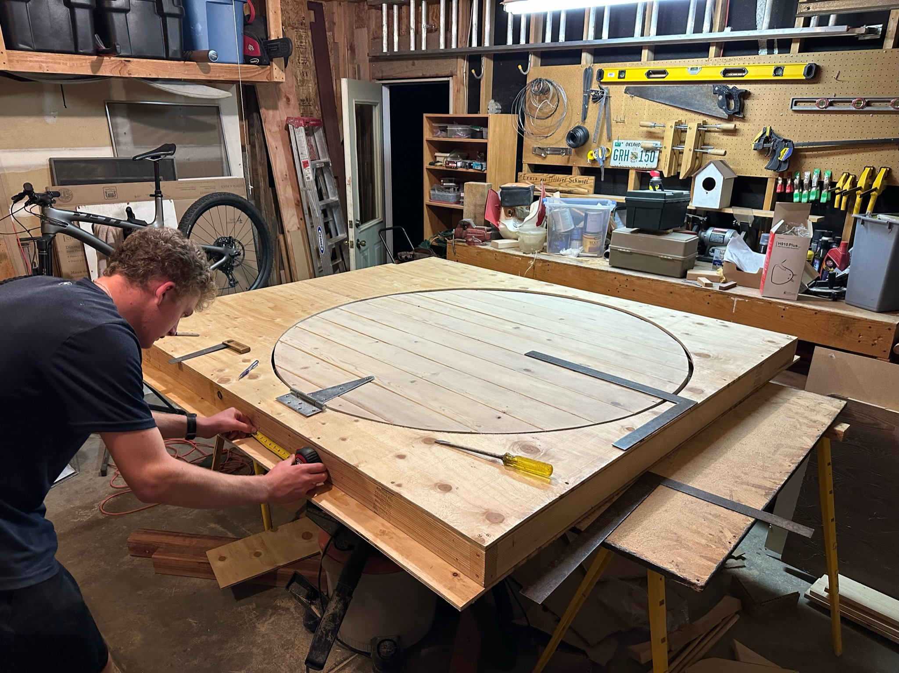
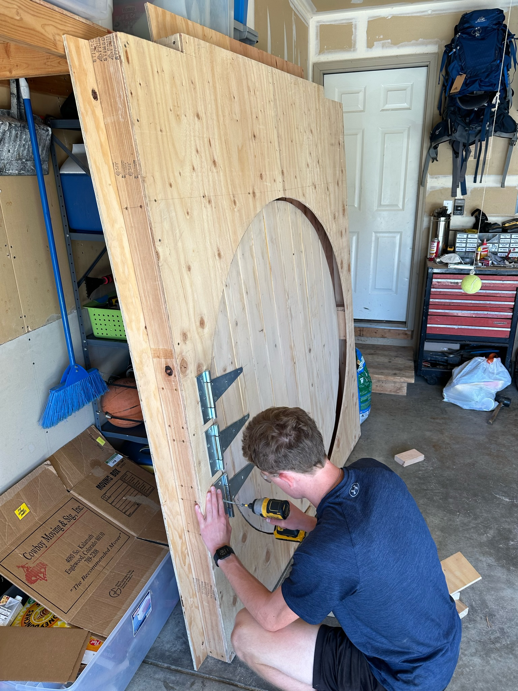
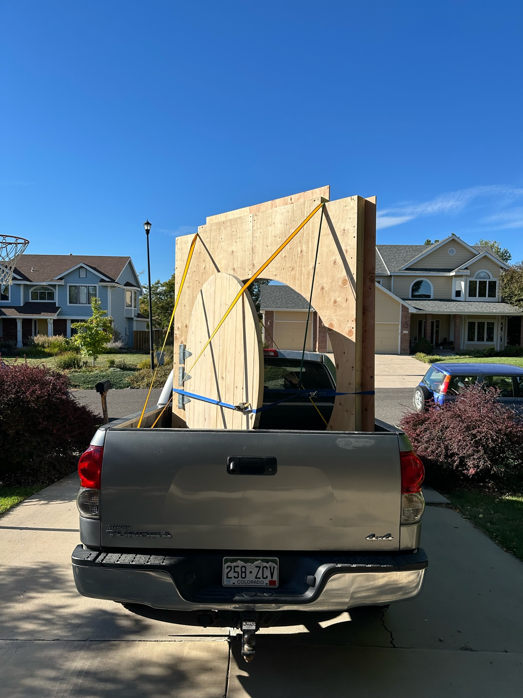
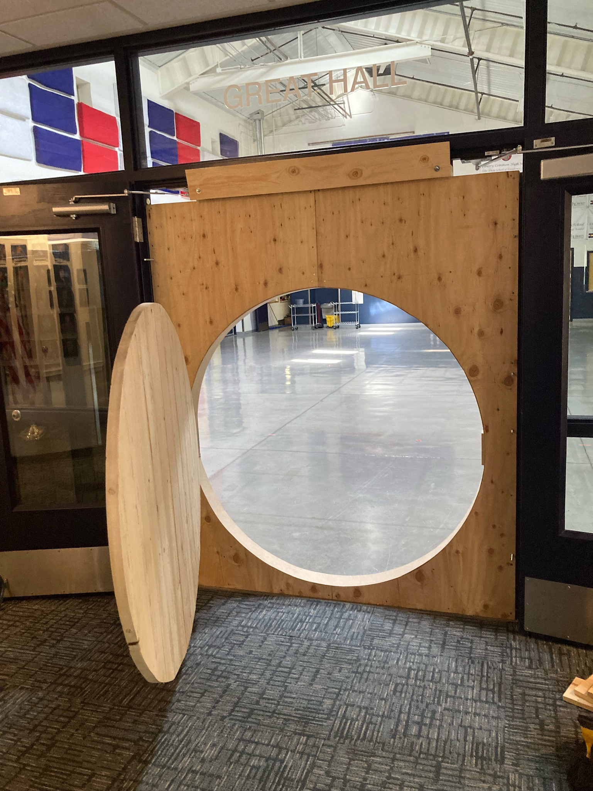
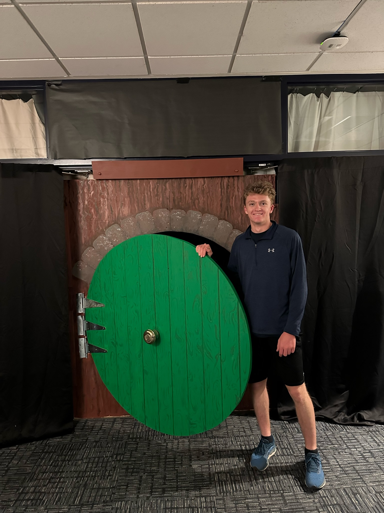
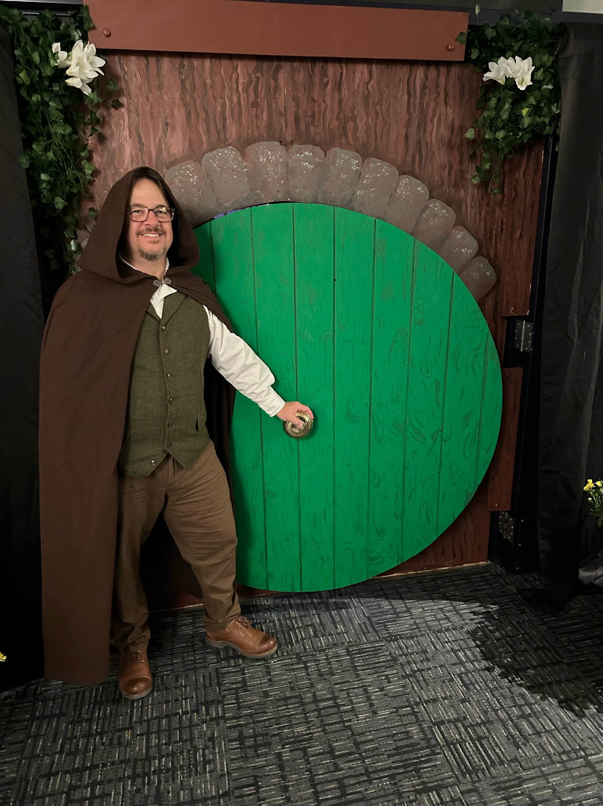

## The problem

A round door is a carpentry problem wearing a costume. Normal door framing
quietly depends on right angles — square jambs, a flat top, hinges on a straight
edge. A circle gives you none of that, and it still has to hang true, swing
without binding, and close against its opening.

The project also grew. It started smaller than it finished, and I chose to scale
it to a full **8-foot functional door** rather than stop at what was asked for.

## Laying it out

Everything downstream depends on the circle being right. I built up the panel
first, then struck the arc across the assembled boards so the grain ran
continuously through the finished face.

Cutting it is the committing step — there's no undo on a circle.

## Moving it

An 8-foot door is a reminder that dimensions on a screen have consequences. It
had to be transported standing up and strapped down.

## Hanging it

Hung in its opening and swinging. This is the point where you find out whether
the layout was actually accurate, because a circle that's even slightly out will
bind against the frame partway through its swing.

Painted and finished, with strap hinges and a centred knob.

## Result

A finished 8-foot working Hobbit door, built over three months of CAD, woodwork,
and carpentry — and used as the entrance it was designed to be.

The useful engineering lesson was the gap between a model that closes cleanly in
CAD and an assembly built from material that has grain, moisture content, and
its own opinions about staying flat. The CAD model was a starting point, not an
answer.
