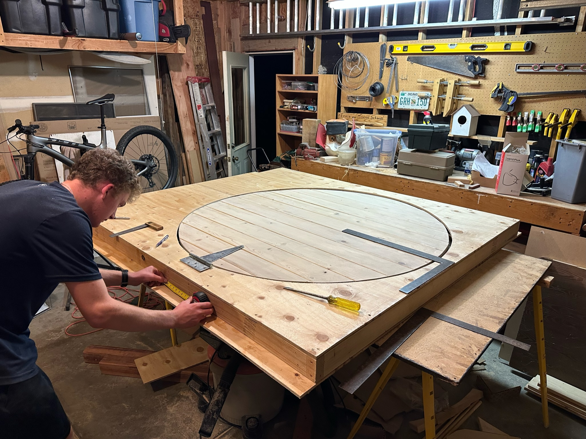
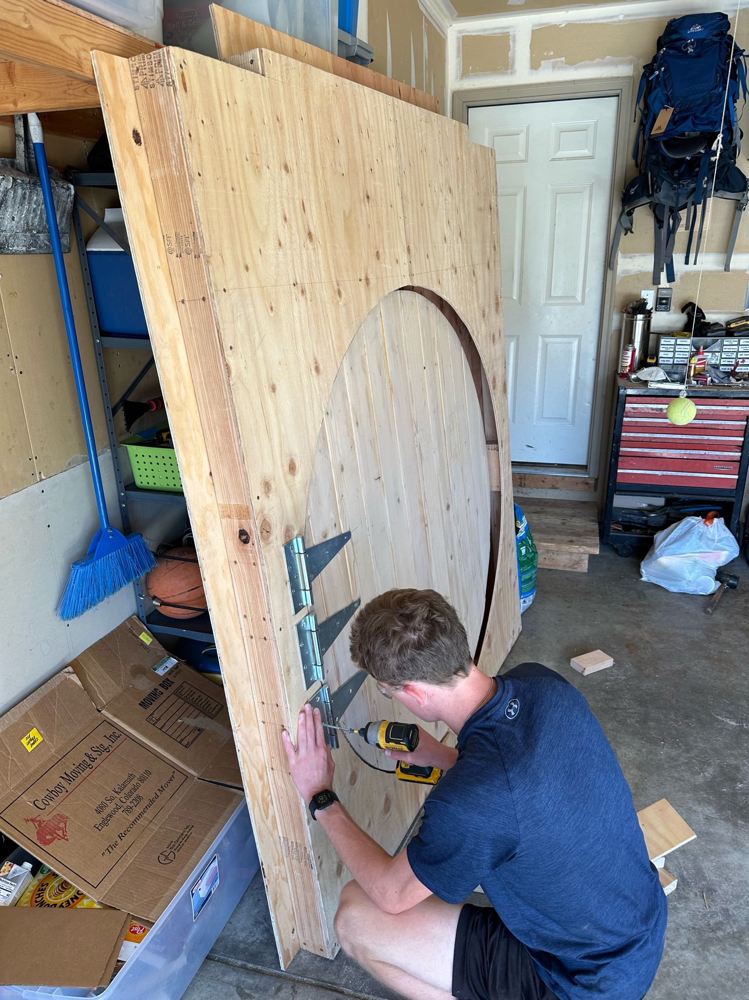
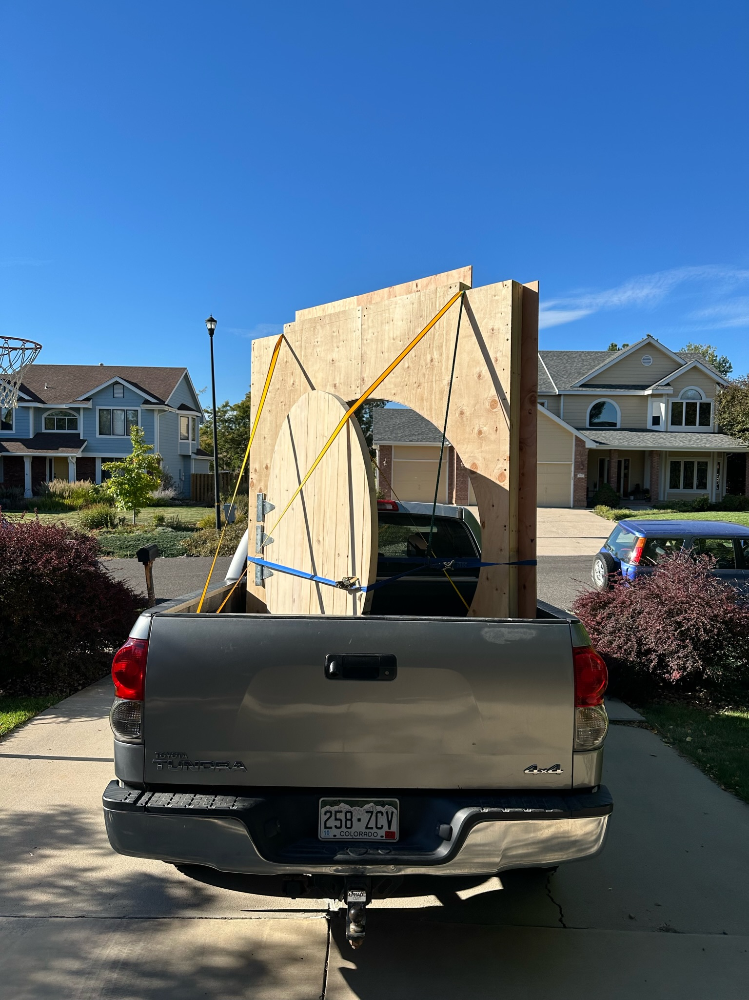
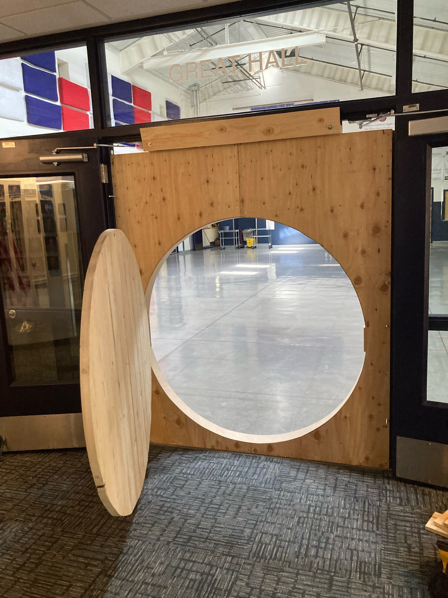
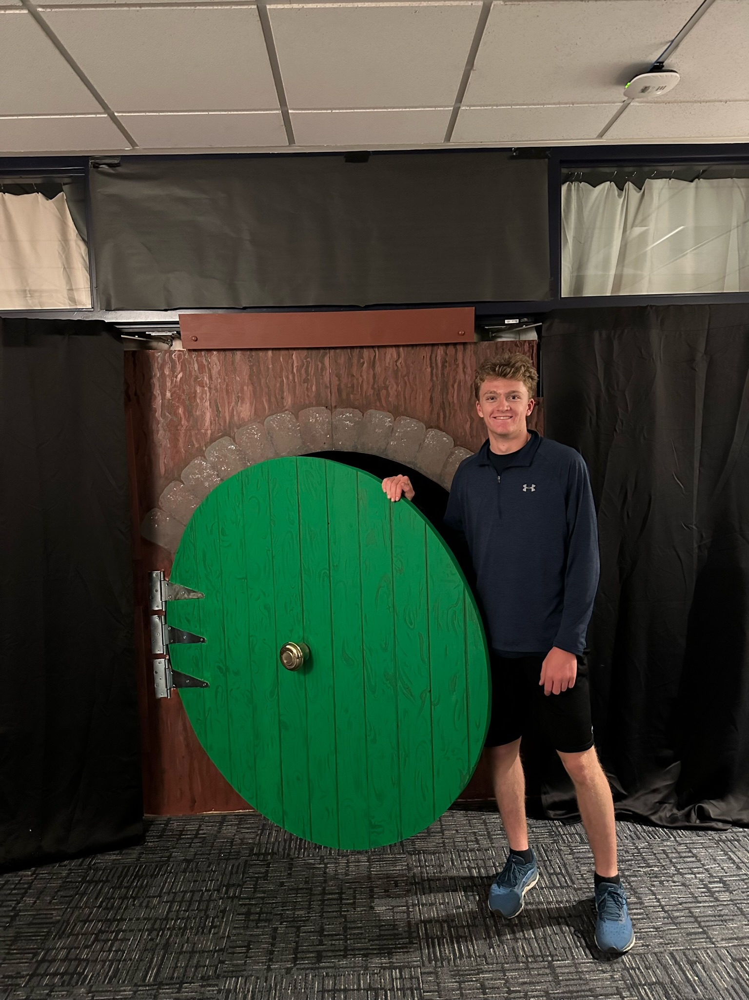
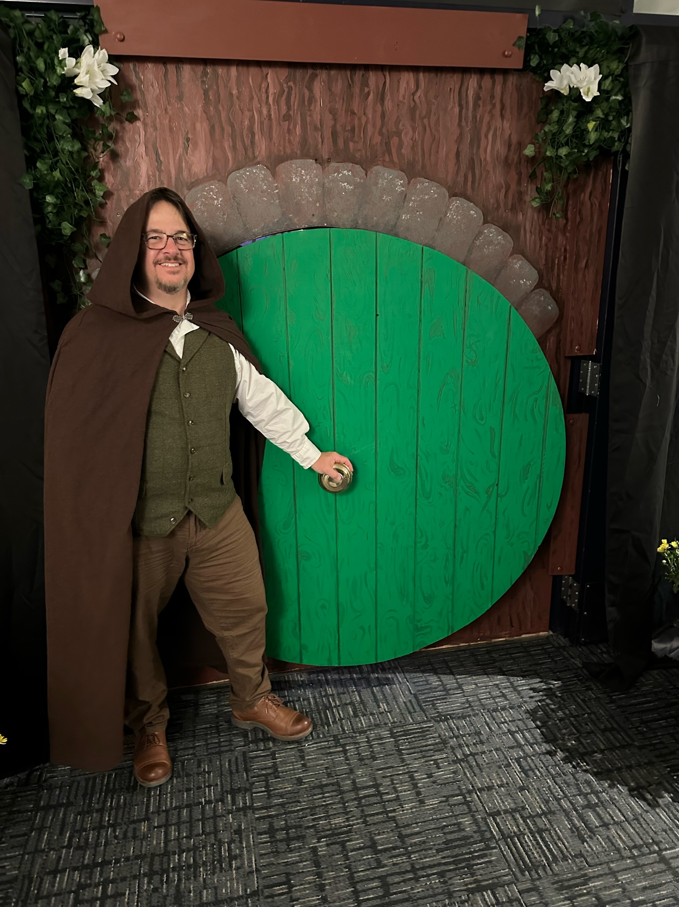

## The problem

As part of being a student leader at my high school, I was tasked with planning a Homecoming dance one fall. I took this opportunity to make something awesome, and I decided to build a giant Hobbit door to make the dance something special.

## Laying it out

I started by taking measurements of the entrance to the dance hall, looking at reference images, and eventually designing the entire door in CAD. I went to the hardware store, bought all the materials I needed, and began construction.

The door ended up weighing close to 60 pounds, so additional hinges were needed to keep it stable and supported.

## Moving it

After I built it in my garage, I had a friend help me transport it across the city to my high school. We strapped it down and locked everything in place.

## Mounting it

This was the first time I saw the door mounted in place, and seeing everything fit together so perfectly was a huge relief. I ended up being off on one dimension by an inch, but it was a simple fix: the clamps that went around the door hinges were cut slightly too long, so I took them home and had them cut to length.

Painted and finished, the door had a centered knob and clamps around the hinges.

## Result

A finished 8-foot working Hobbit door, built over three months of CAD, woodwork, and carpentry, and used as the entrance it was designed to be. The event was a huge success, and I had so much fun with this project.

