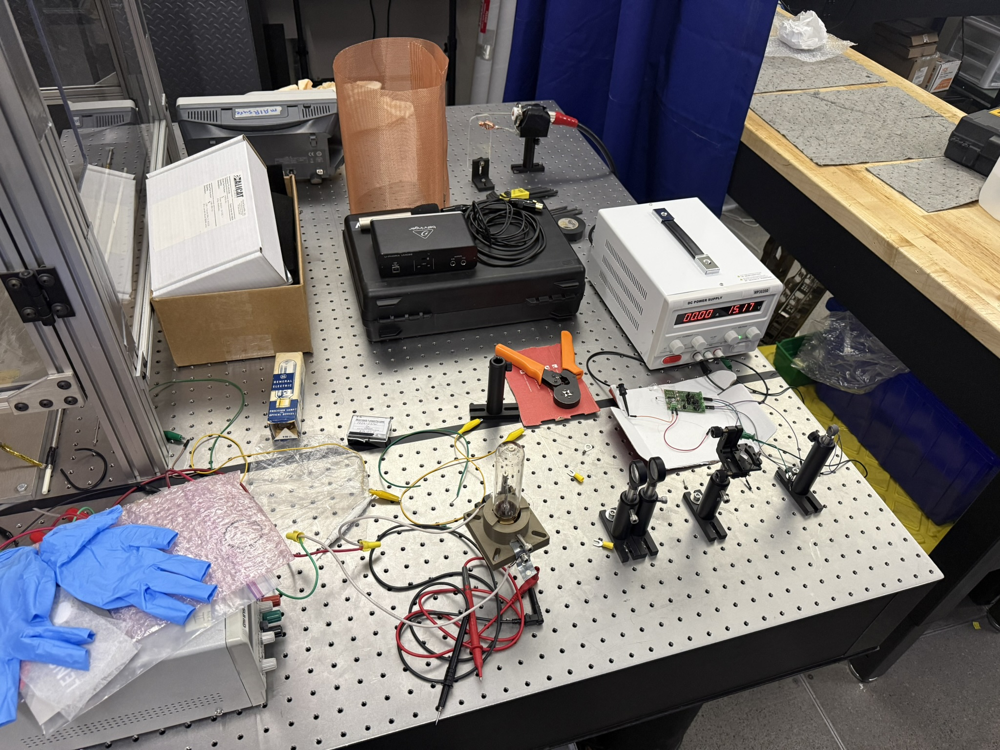
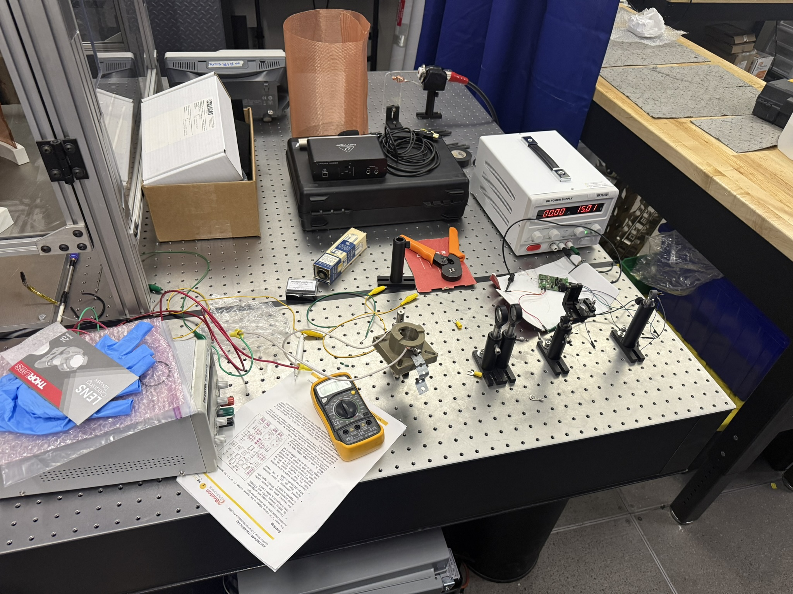
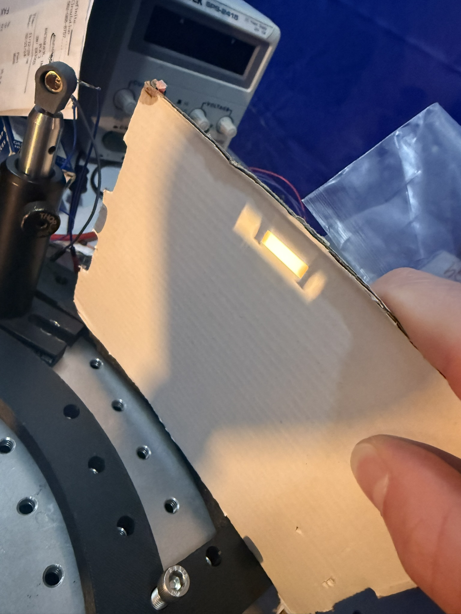
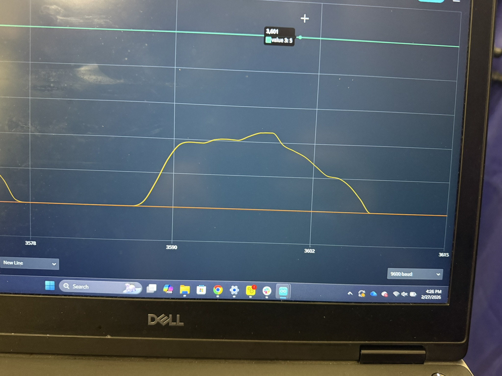

## The problem

Fire has a distinctive infrared signature, but picking it out of everything else
emitting in the same region is the hard part. Detecting it early — without the
false alarms that make a detector useless — means responding to specific narrow
bands rather than to broad IR intensity.

The target bands were **2 µm and 4 µm**, isolated with photodiodes, lenses, and
prisms.

## The optical bench

Working through CSU's **SURE Research** program alongside graduate students and
research faculty, the work happened on an optical breadboard where source,
dispersing optics, and detector could all be repositioned independently.

## Controlling stray light

An early problem was light reaching the detector by paths we hadn't intended —
reflections off the breadboard, the mounts, and everything else in the room.
Stray light doesn't just add noise; it adds a *signal* that looks real.

So we enclosed the source in a printed shield to block those reflection paths.

That shield ran into a materials problem worth recording: the source put out
enough heat to threaten the **PLA** it was printed from. We lined the inside
with tin foil, which both reflected the heat back and stopped the plastic
reaching temperatures it couldn't survive.

It's a small fix, but it's a good example of a physical constraint that never
appears in the optical design — the optics don't care what the enclosure is made
of, right up until the enclosure melts.

## Finding the detector's best position

Once the light is dispersed, the wavelengths are smeared out across a physical
distance. The photodiode has to sit at the position where the band you care
about actually lands — and getting that by calculation alone is optimistic.

To find it empirically we built a **curved arc** that sweeps the photodiode
through the smeared light, so we could scan across positions and look for the
local maximum in response rather than guess at it.

That turns detector placement into a measurement instead of an assumption: sweep
the arc, watch the signal, and put the photodiode at the peak.

## Simulation and signal

The optical path was checked against a ray-tracing simulation, so the geometry
on the bench could be compared against where the rays were predicted to go.

On the electronics side, the photodiode output needed conditioning before it was
readable.

## Result

A working benchtop prototype, and a much better feel for how optical design
decisions — element choice, geometry, alignment, and stray light you didn't plan
for — propagate into what a sensor can and can't tell you.
