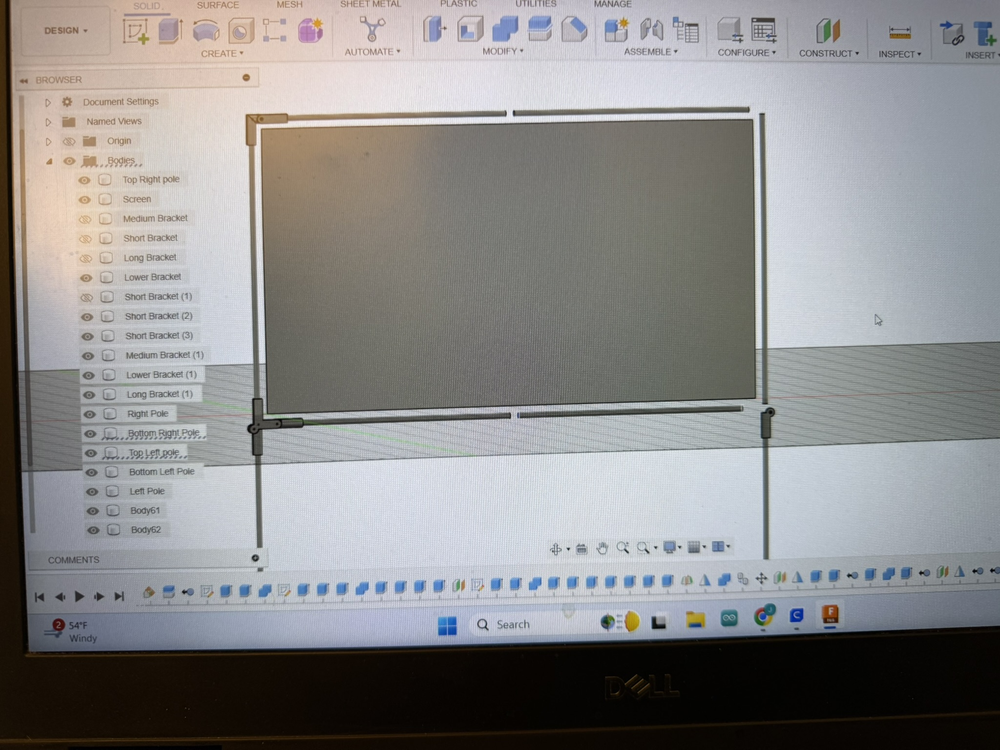
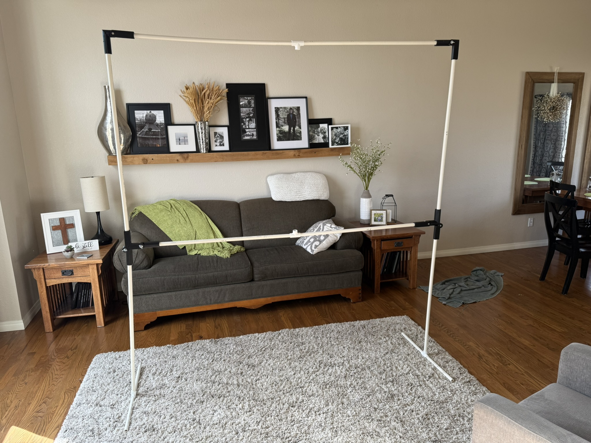
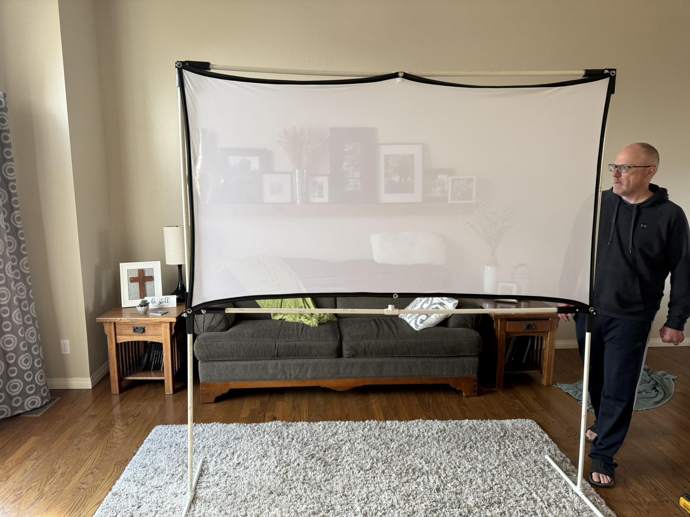
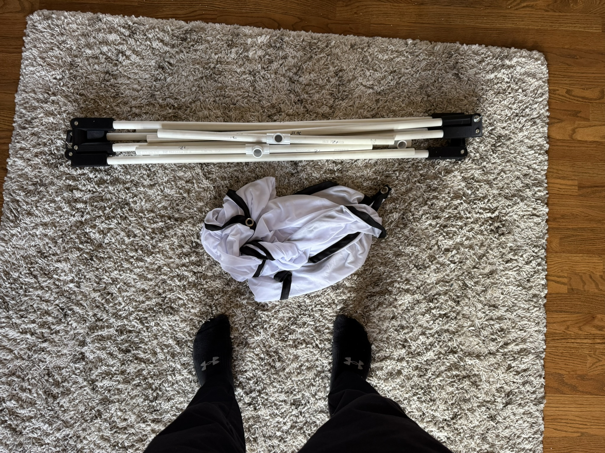
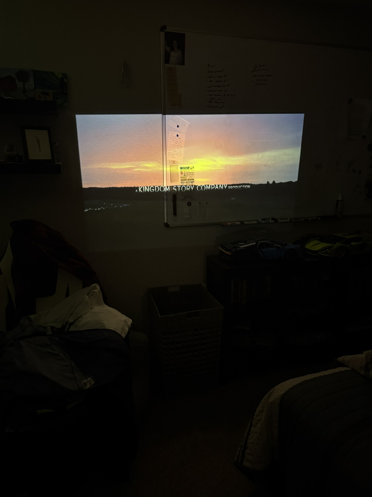

## The idea

A drive-in movie you can have anywhere. The projector sits inside the car and
throws onto a screen you carry with you, so the whole setup travels wherever you
want to watch something.

I built it to make date nights with my girlfriend better, which turned out to be
a useful design brief — it meant the thing had to be genuinely quick to put up,
not a project that needed an afternoon of assembly every time.

## Design constraints

That brief set the real engineering requirements:

- **Freestanding.** No wall, no trees, no guy-lines — it has to hold itself up
  on flat ground.
- **Packs into a car.** Along with the people and everything else you're bringing.
- **Big enough to matter.** An 80-inch screen at roughly 7 feet tall.
- **Cheap and repairable.** If a leg cracks, it should be replaceable from a
  hardware store.

Those pull against each other. Freestanding and tall wants a wide, heavy base;
packing into a car wants small and light.

## CAD first

I modelled the entire frame in **Fusion 360** before buying anything. With PVC
you're constrained to fittings that actually exist — specific elbows, tees, and
pipe diameters — so working it out in CAD first meant the cut list and the
fitting count were settled before I made a single cut.

## Building it

The body of the frame is **PVC**: cheap, light, stiff enough at this scale, and
trivially repairable. The feet are wide enough to keep it stable without needing
stakes or weight.

With the screen fitted, it's a full 80-inch surface held flat and square.

## Packing down

The whole thing breaks down into a bundle of pipe that fits in the car alongside
everything else.

## Result

A working portable screen that sets up on flat ground and takes a projected image
well.

The useful lesson was how much a soft, personal requirement — *this has to be
easy enough that we'll actually bother* — behaves exactly like an engineering
constraint once you take it seriously. Setup time drove the whole design more
than screen size did.
