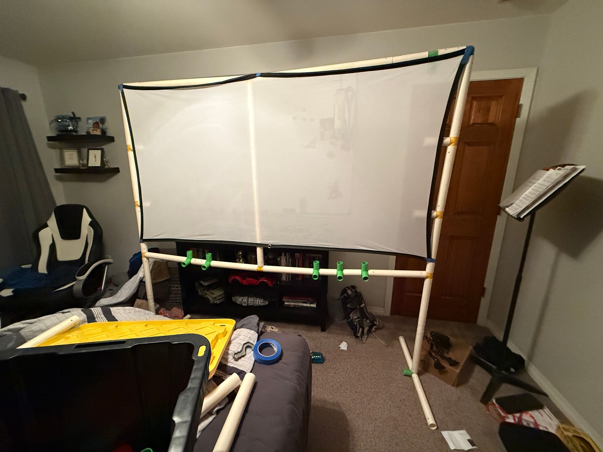

## The idea

To celebrate my girlfriend's birthday one year, I wanted to surprise her with something special. She absolutely loves rom-coms, and had never been to a drive-in but had always wanted to. I thought I could kill two birds with one stone: design my own drive-in movie theater and surprise her with a drive-in rom-com movie night.

## The prototype

I started with a pipe-connecting toy kit to make the first design. It worked reasonably well, but it took up a lot of space and was hard to take apart quickly.

## Design constraints

Because of the shortcomings of the first version, it became necessary to add constraints for the second draft. The three largest were:

1. Quick and easy to assemble and disassemble
2. Small and compact
3. Cheaper than buying a screen online

## CAD

To address these problems, I started by making a design in Fusion 360. I made the body of the frame out of PVC, while the joints were custom 3D prints to make setup and teardown easier.

## Building it

After designing and printing the parts, it was finally time to put it all together.

With the screen fitted, it's a full 80-inch surface held flat and square.

## Packing down

The whole thing breaks down into a bundle of pipe that fits in the car alongside everything else.

## Result

A working portable screen that sets up on flat ground and displays a movie clearly. Most importantly, it made for an amazing drive-in experience.

## What I learned

This project taught me the value of placing constraints on a system before designing. The prototype worked for what we needed it to, but in reality we never would have used it again unless I had redesigned it around these constraints.

In the real world, this means listening to the client and empathizing with their situation before putting pen to paper. A fundamental understanding of the problem you are trying to solve leads to the best solutions. 