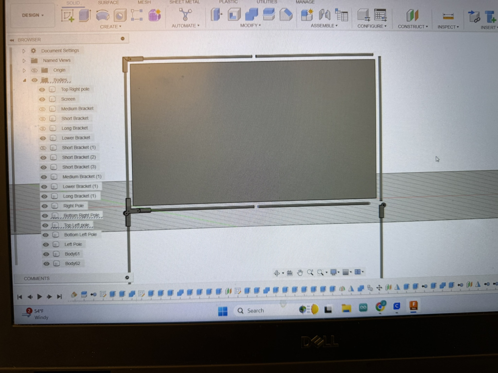
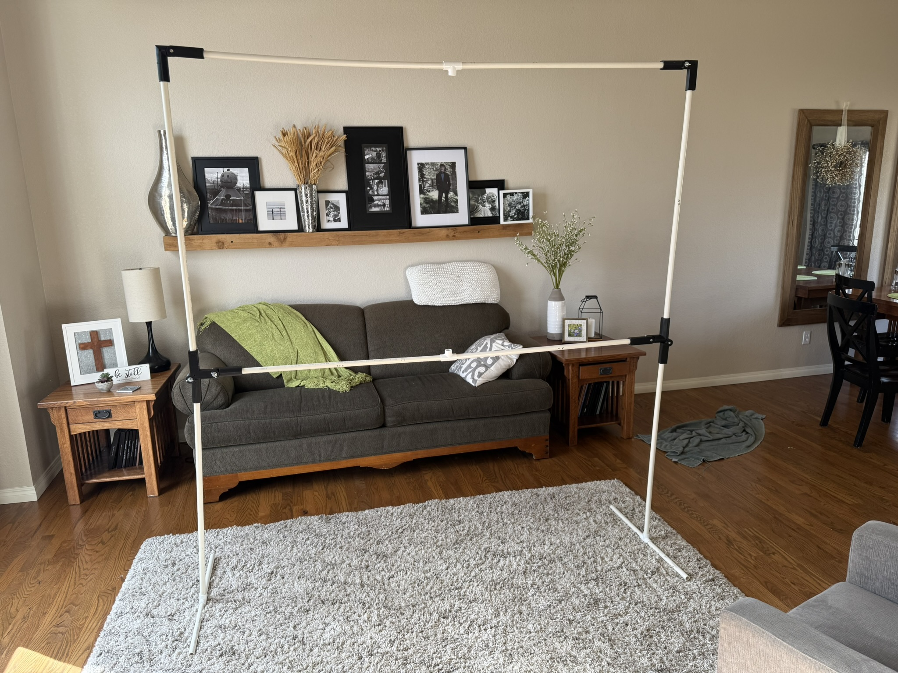
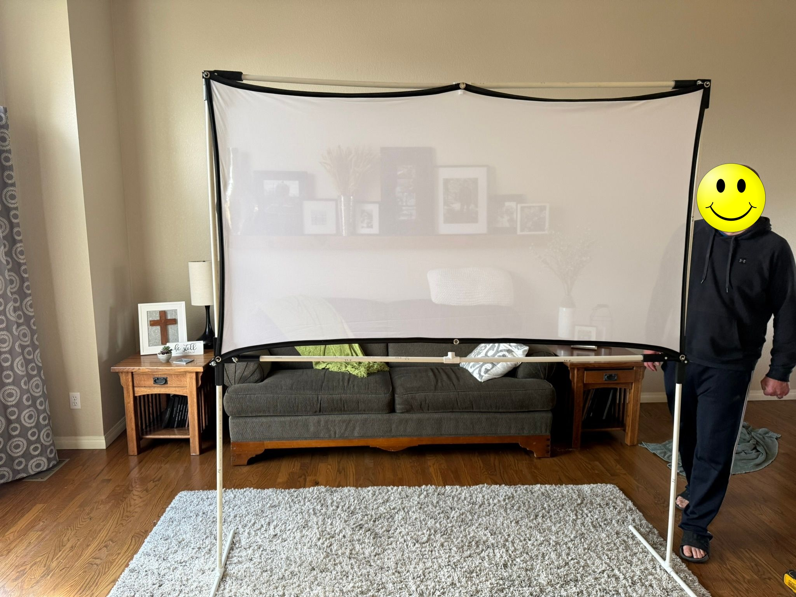
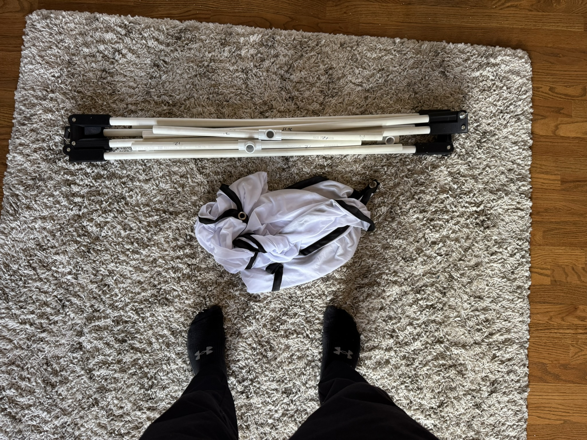
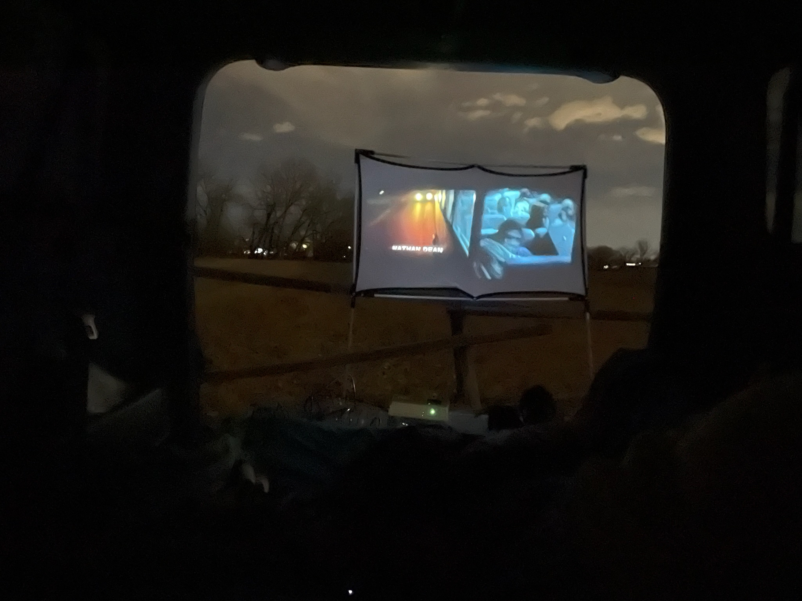

## The idea

To celebrate my girlfriend's birthday one year, I wanted to surprise her with something special. She absolutely loves rom-coms, and had never been to the drive-in, but always had wanted to. I thought I could get two birds with one stone and design my own drive-in movie theater, and surprise her with a drive-in Rom-Com movie night. 

## The Prototype

I started with a pipe-connecting toy kit to make the first design. It worked decenlty well, but it took up a lot of space and was hard to take apart quickly.

(Insert new image I just sent you of the pipe-based screen, with the cloth attached)

## Design constraints

Due to the failures of the first version, it became nescessary to add constraints for the second draft. The largest three constraints were:
1. Quick and easy to assemble and disassemble
2. small and compact
3. Cheaper than buying a screen online

## CAD

To adress these problems, I started by making a desing in Fusion 360. I made the body of the frame out of PVC, while the joints were made out of custom 3d prints to aid in the ease of set up and tear down. 

## Building it

After desinging and printing the parts, it was finally time to put it all together. 

With the screen fitted, it's a full 80-inch surface held flat and square.

## Packing down

The whole thing breaks down into a bundle of pipe that fits in the car alongside everything else.

## Result

A working portable screen that sets up on flat ground and displays a movie clearly. Most importantly, it made for an amazing drive-in experience. 

## What I learned

This project taugth me the value of placing constraints on a system before designing. The prototype worked for what we needed it to, but in reality we never would have gone again unless I had redesigned it around these constraints

In the real world, this means listening to the client and emphatizing with their situation before putting pen to paper. A fundamental understanding of the problem you are trying to solve will lead to the greatest solutions. 