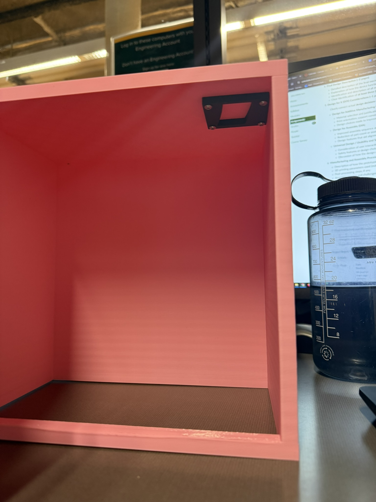

## The brief

Design a cabinet with a latching mechanism, and design it *for* additive
manufacturing rather than just printing a part that was drawn for some other
process.

The mechanism requirement is the interesting half. The latch has to be operable
**with a single hand**, while still being enough of an obstacle that a small
child can't casually get it open. Those two goals pull in opposite directions —
anything you make harder to defeat, you usually also make harder to use.

## The mechanism

The latch is a separate printed assembly mounted at the top inner corner of the
door, in black against the pink cabinet body.

Mounting it at the top does real work: it puts the release out of easy reach for
a child while sitting exactly where an adult's hand already is when they reach
for the door.

## Designing for the printer

Printing the cabinet as a set of flat panels rather than one solid box keeps
every face buildable without support material, and the layer lines visible in
the photos run along the walls rather than across the load path.

The latch is printed separately, in a different material colour, and fastened in
— which means it can be revised, reprinted, and swapped without reprinting the
whole cabinet. That's the practical version of design for assembly: put the part
most likely to need iteration on its own.

## Result

A working cabinet and latch that meet the single-handed requirement, printed as
separable components sized to the machine.

The constraint I'd underestimated was how much the *printing* decisions and the
*mechanism* decisions constrained each other. A latch geometry that works
beautifully in CAD can be unprintable without support in the orientation the
rest of the part needs — so the mechanism and the build orientation had to be
designed together rather than in sequence.
