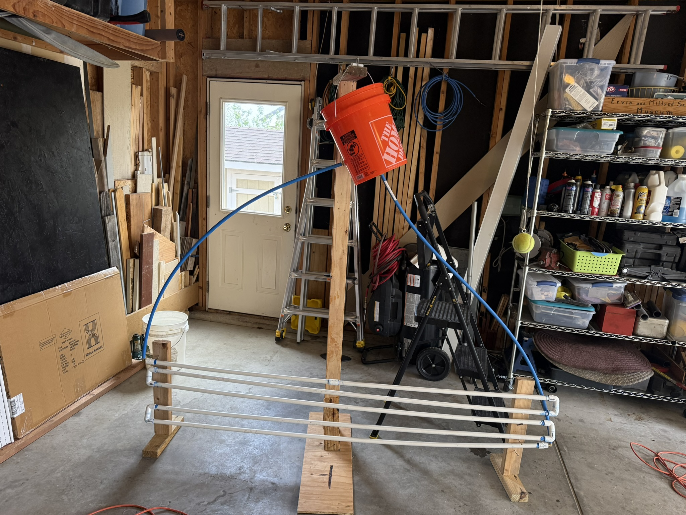
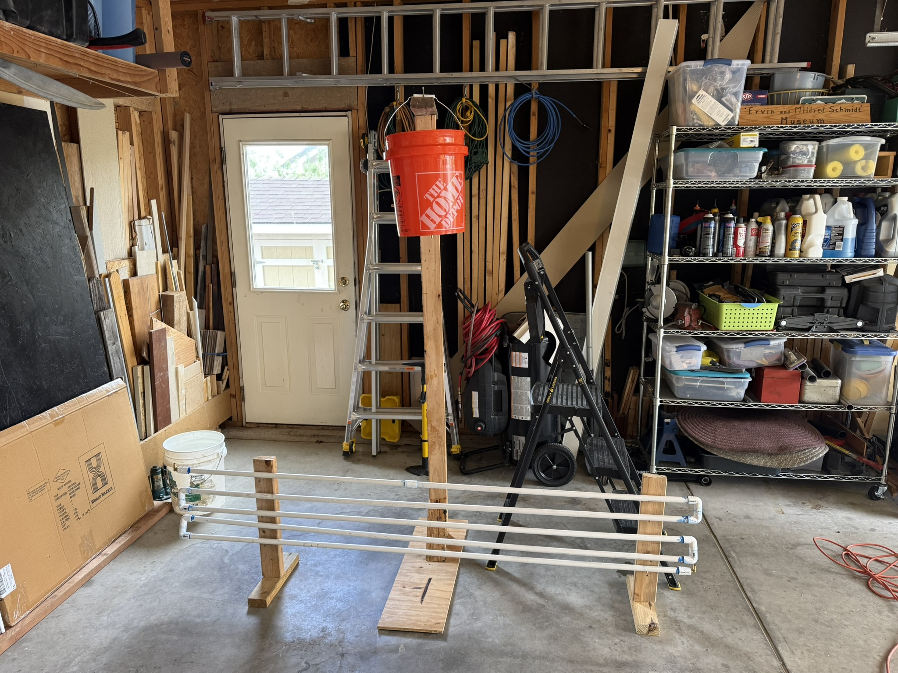
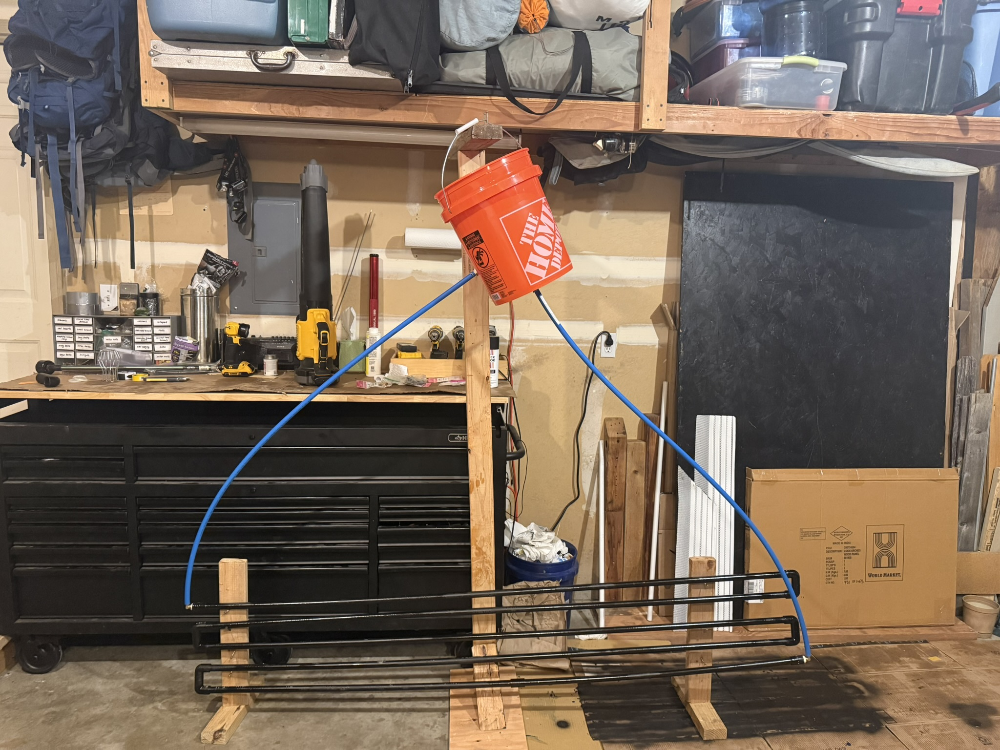
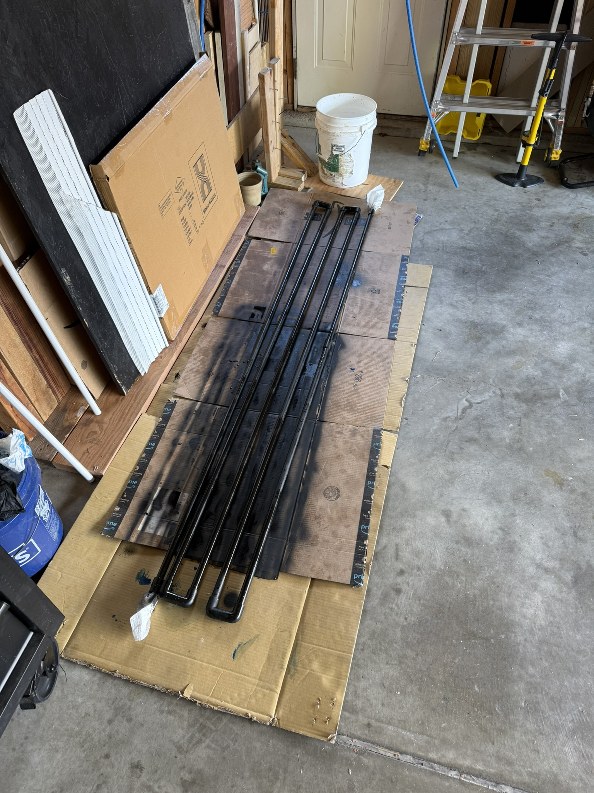
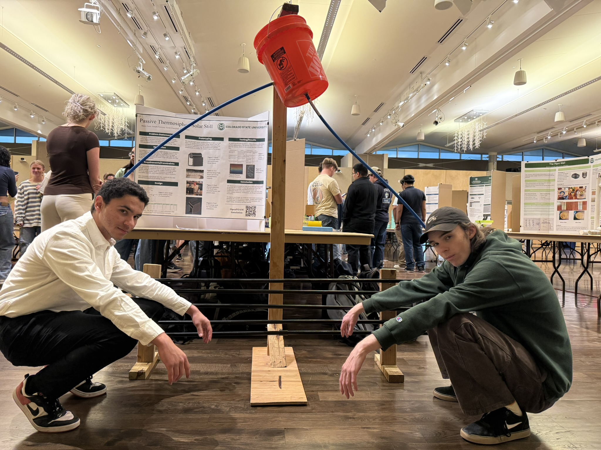

## The problem

Solar stills are only useful where they're affordable. Anything with a pump adds
cost, a power requirement, and a part that will eventually fail — which defeats
the point in exactly the places a still is most needed.

The constraint was a still that runs on sunlight alone, from parts someone could
actually source, for under $60.

## How it works

The design drives its own circulation by **thermosiphon**. Water in the collector
warms, becomes less dense, and rises; cooler water sinks to replace it. That
density difference is the entire pump.

Which means the geometry *is* the pump. Get the height difference between
reservoir and collector wrong, or the tube runs wrong, and the loop simply
doesn't establish — there's no motor to cover for a bad layout.

The reservoir is a **Home Depot bucket**, elevated on a timber A-frame to give
the loop the head it needs. The collector is the horizontal tube array at the
bottom, connected by the blue tubing running between them.

## Validating before building

Because the whole design depends on convection actually establishing itself, we
ran **OpenFOAM** simulations to confirm the convection-driven flow before
committing to a physical build. A thermosiphon that doesn't siphon is a pile of
tubing, and we wanted to know which geometry worked before we cut anything.

## Result

- **~3 L/hour** of water output
- **Under $60** in parts, all from accessible suppliers
- **No pump, no moving parts** — passive from end to end

We presented the finished still at an expo to judges, classmates, and members of
the community. Our professor consistently ranked the project at the top of the
class.

