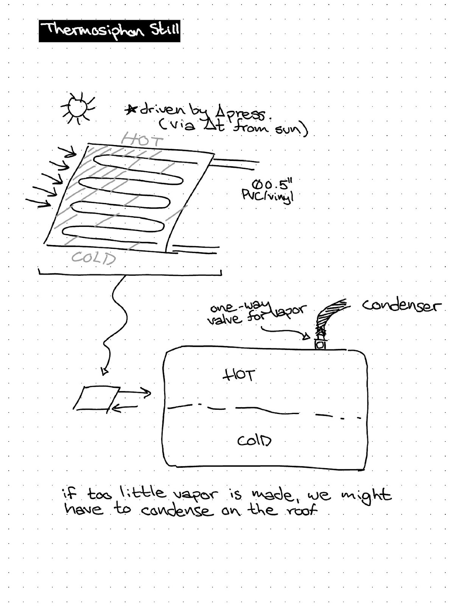
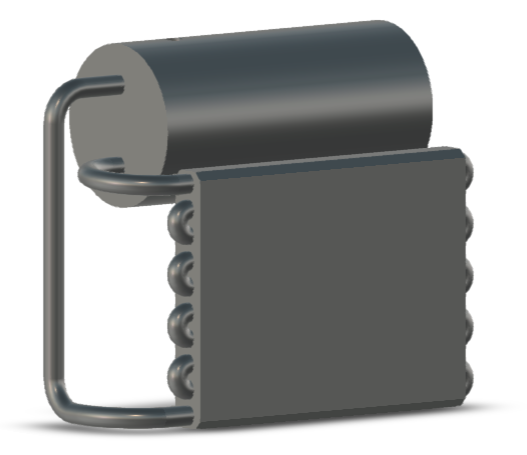
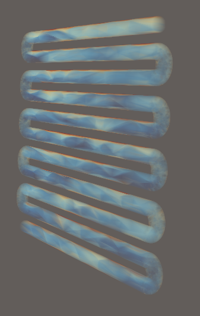
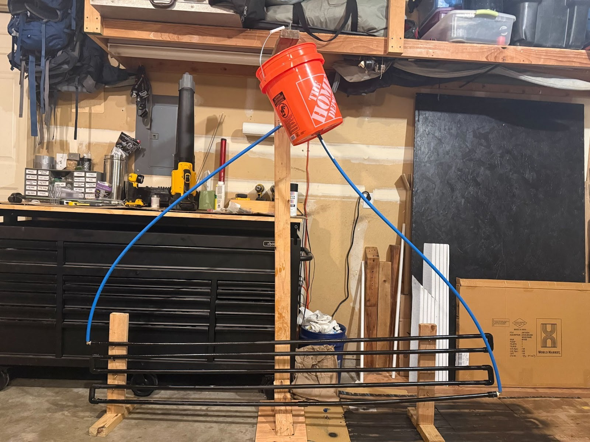

## The problem

Solar stills are only useful where they're affordable. Anything with a pump adds
cost, a power requirement, and a part that will eventually fail — which defeats
the point in exactly the places a still is most needed.

The constraint was a still that runs on sunlight alone, from parts someone could
actually source, for under $60.

## How it works

The design drives its own circulation by **thermosiphon**. Water in the collector
warms, becomes less dense, and rises; cooler water sinks to replace it. That
density difference is the entire pump.

Which means the geometry *is* the pump. Get the height difference between
reservoir and collector wrong, or the tube runs wrong, and the loop never
establishes — there's no motor to cover for a bad layout.

That sketch is where the layout got settled: a serpentine collector run in
½-inch PVC, driven by the pressure difference the sun's temperature gradient
creates, feeding a tank with a one-way vapour path to a condenser.

## Simulating before building

Because the whole design depends on convection actually establishing itself, we
modelled the collector in **OpenFOAM** before committing to a build. A
thermosiphon that doesn't siphon is just a pile of tubing.

The simulation showed the convective flow developing through the serpentine run,
and put the expected output at roughly **3 L/hour** — comfortably past the 2 L
per day the requirement asked for.

## Building it

The collector is a serpentine run of PVC on a timber frame; the reservoir is a
Home Depot bucket, elevated to give the loop the head it needs.

## Result

- **~3 L/hour** predicted output — from the OpenFOAM model, not a measured yield
- **Under $60** in parts, all from a hardware store
- **No pump, no moving parts** — passive from end to end
- Convective flow and pressure containment both **confirmed on the physical
  prototype**

Worth being precise about which of those came from where: the flow behaviour and
the sealing were verified on the build, but the 3 L/hour figure is the
simulation's prediction. A full sunrise-to-sunset yield test on the physical
still is the piece still missing.

We presented at an end-of-semester expo to judges, classmates, and members of the
community. Our professor consistently ranked the project at the top of the class.

