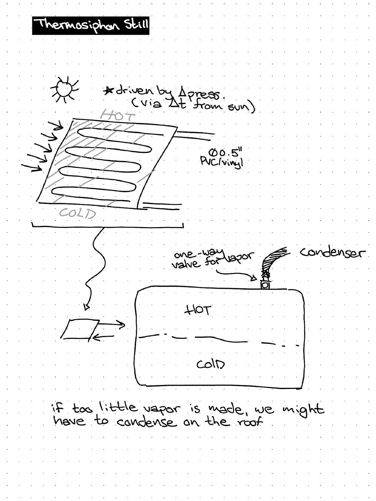
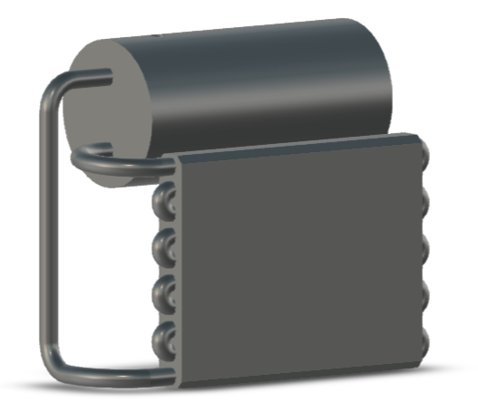
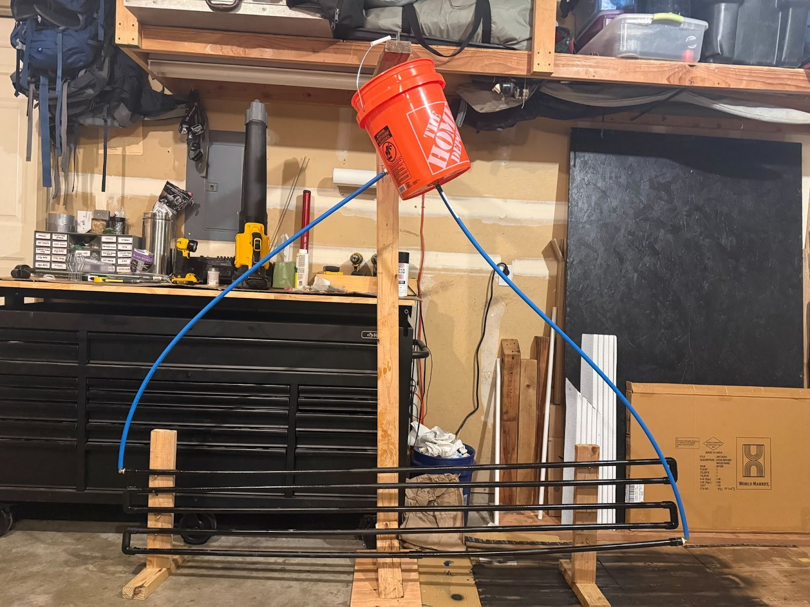
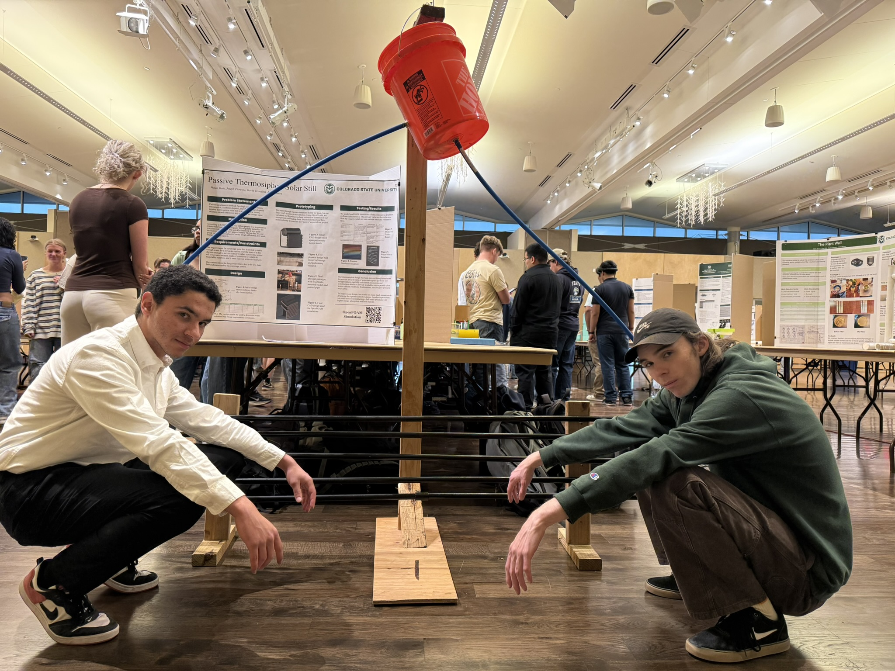

## The problem

Despite living in a modern world, there are still a very large number of people who do not have access to clean water. This project was our attempt at making a reliable, affordable, and universal water purifier for these communities.

## How it works

After doing much research, one of the people in my group brought up the idea of a thermosiphon. It is a type of water heater used in the Middle East that uses sunlight to create convection flows inside the pipes. This convection flow drives all of the water in the thermosiphon to circulate inside, slowly heating the water to a boiling temperature.

We saw this technology and wondered if we could use it to purify water for underdeveloped communities.

This was our initial concept sketch: a serpentine collector run in ½-inch PVC, driven by the pressure difference created by the sun, feeding a tank with a one-way vapor path to a condenser, where the clean water is collected.

## Building it

The collector is a serpentine run of PVC on a timber frame; the reservoir is a Home Depot bucket, elevated to give the loop the necessary potential difference to allow the thermosiphon to run.

## Simulating the flow

With no budget left over and a remarkably cloudy and cold April, we decided to prove our concept through simulation.

We chose to use OpenFOAM to run our fluid simulation, because it is free, open-source software with a lot of support and documentation surrounding it.

The simulation showed the convective flow developing through the tubes, and put the expected output at roughly 3 L/hour, significantly above what we decided was necessary for this project.

## Result

We presented at an end-of-semester expo to judges, classmates, and members of the community. Our professor consistently ranked the project at the top of the class.

## What I learned

This was the first group project I have ever been a part of in which I was not the primary leader when it came to ideas. Gavin (the student in the green CSU shirt) was the central mastermind behind this project. For me, this meant I had to learn how to be a good follower instead of a good leader. I had to understand what Gavin wanted from each of us and help him establish his vision for this project.

Going forward, this project showed me how to be a good leader by showing me what it takes to be a good follower. I understood the traits that make a good leader from a different perspective, and I feel better able to relate to and serve those I lead. 