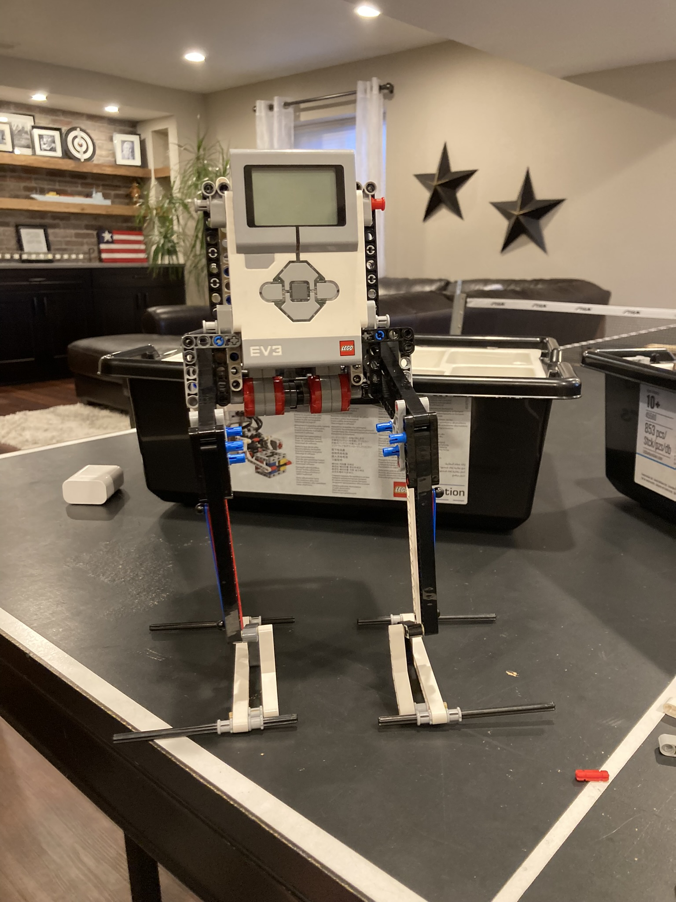
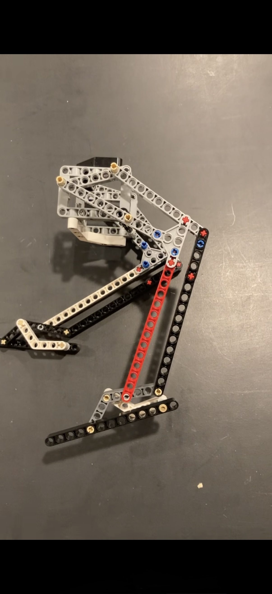
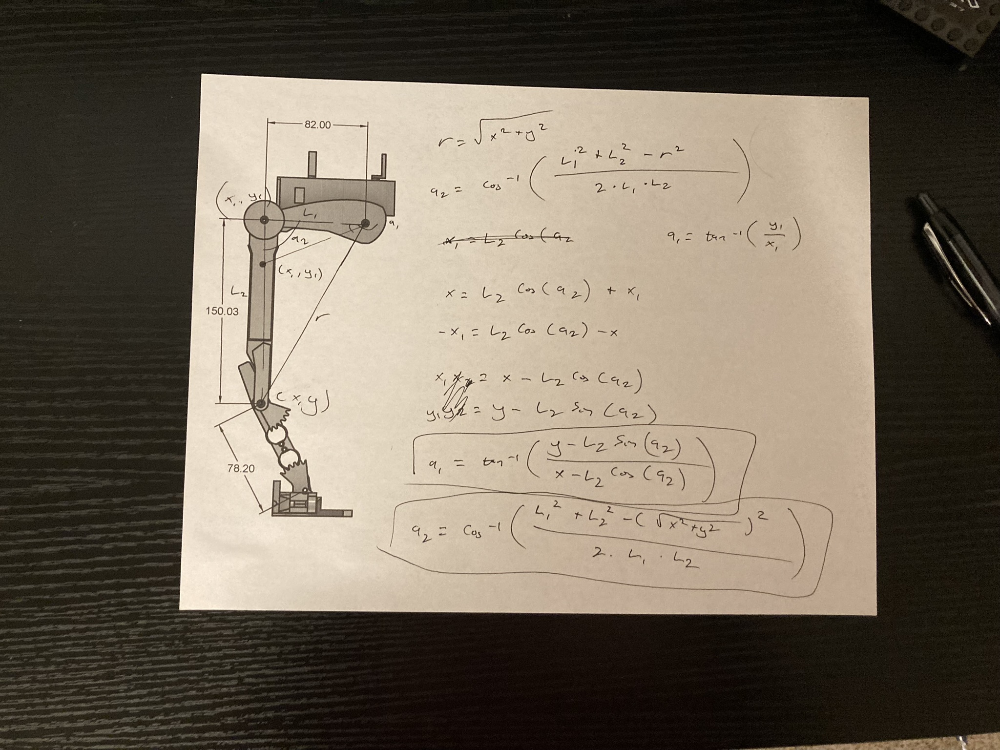
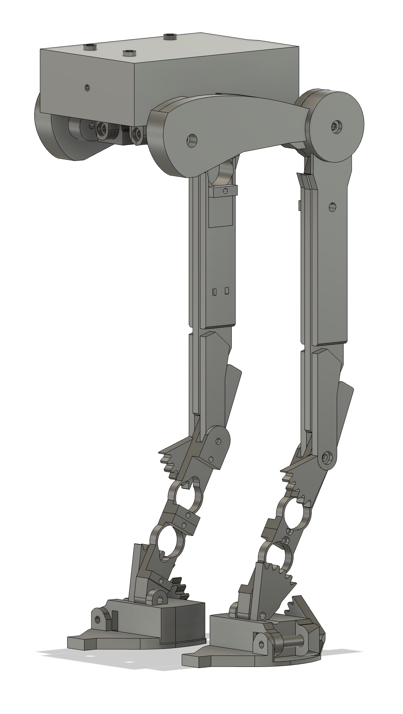
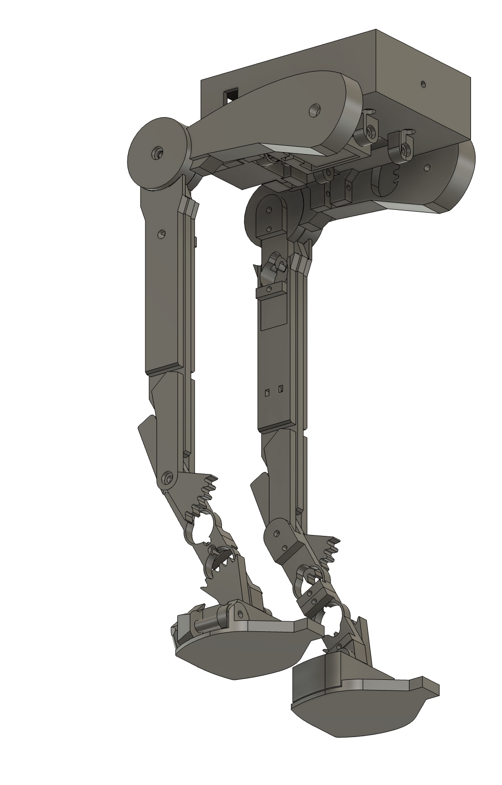
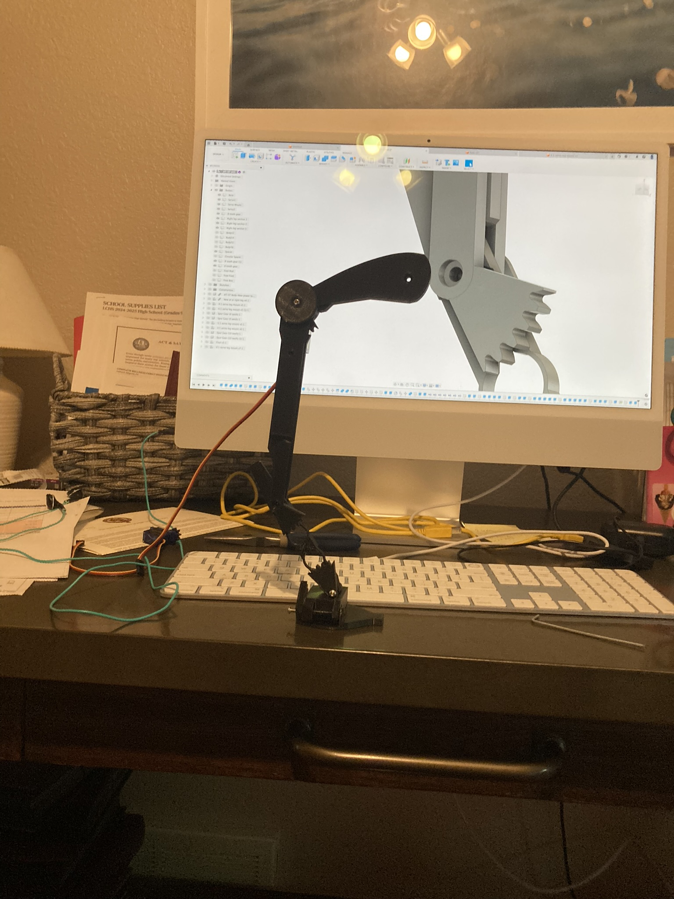
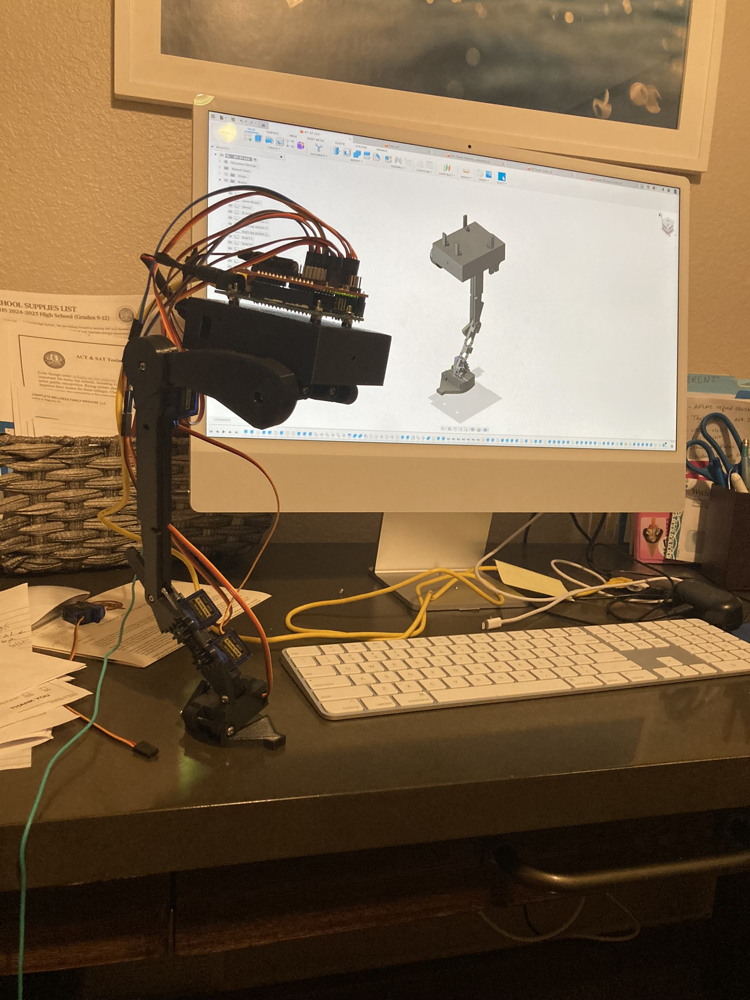
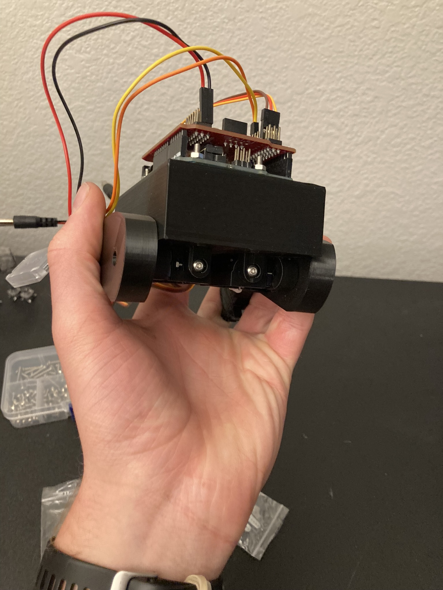
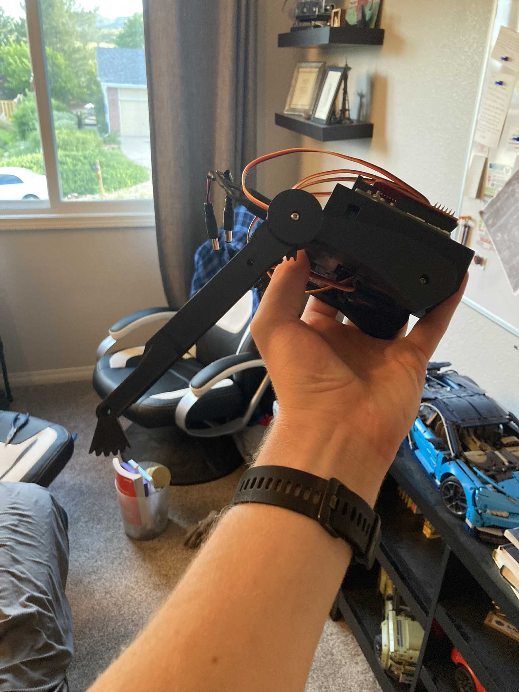

## The problem

A two-legged walker is a hard mechanism. It has to carry its own weight, stay
balanced through a gait, and do it with linkages and actuators that fit inside a
shape nobody designed with statics in mind. The AT-ST's silhouette is all
overhanging body and thin, reverse-jointed legs — which is exactly the wrong
mass distribution for walking, and exactly why it's an interesting thing to try
to build.

This has been my long-running project since 2023, and it's where most of what I
know about mechanisms and electronics actually came from.

## Prototyping the mechanism in LEGO

I didn't start in CAD. Before committing to printed geometry I built the leg
mechanism in LEGO Technic driven by an EV3 controller, because it let me change
link lengths and joint positions in minutes instead of hours.

The point wasn't to make LEGO walk well. It was to find out which linkage
arrangement produced a usable foot path before any of it was expensive to
change.

## The kinematics

Once the leg had a defined geometry, the question became how to actually
command it. Each leg is a two-link chain, so driving the foot to a point means
solving backwards from the target position to the two joint angles.

I worked the inverse kinematics out by hand — law of cosines for the knee angle,
then an arctangent for the hip, using the link lengths straight off the CAD
model.

That sheet is the bridge between the mechanical design and the code. Without it
the servos are just three arbitrary angles; with it, the foot goes where you
tell it.

## CAD

With the geometry settled, the whole thing was modelled as an assembly in
Fusion 360 — body, hips, the reverse-jointed legs, and the clawed feet.

## Printed hardware

Printed parts, micro servos at each joint, and a controller board mounted on top
of the body.

Comparing the printed part against the model on screen is where the iteration
happens — tolerances at the joints, clearance for the servo horns, whether a
link is stiff enough at the printed wall thickness.

The feet were their own problem: they carry the whole load at the moment of
contact, and on this design they're also the most visually distinctive part.

## Result

Still ongoing, which is the point of it. It's the project where I get to be
wrong cheaply — and the loop of *prototype the mechanism, derive the math, model
it, print it, find out what I missed* is the closest thing I've had to real
engineering practice outside of a lab.
