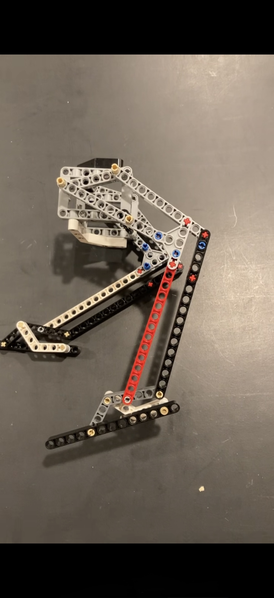
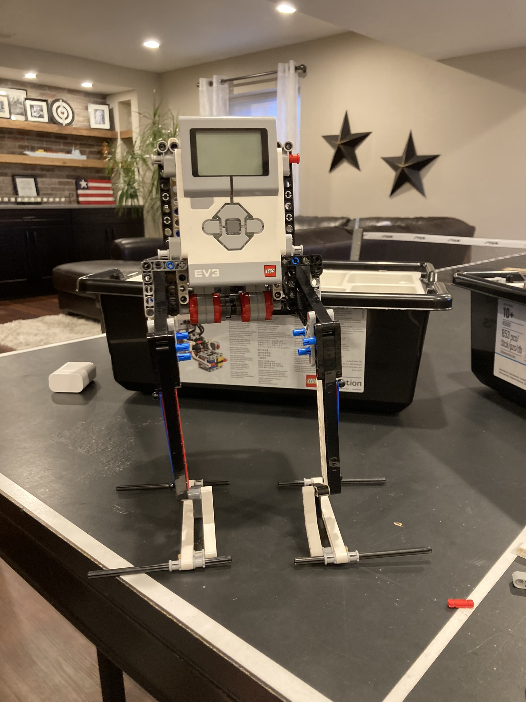
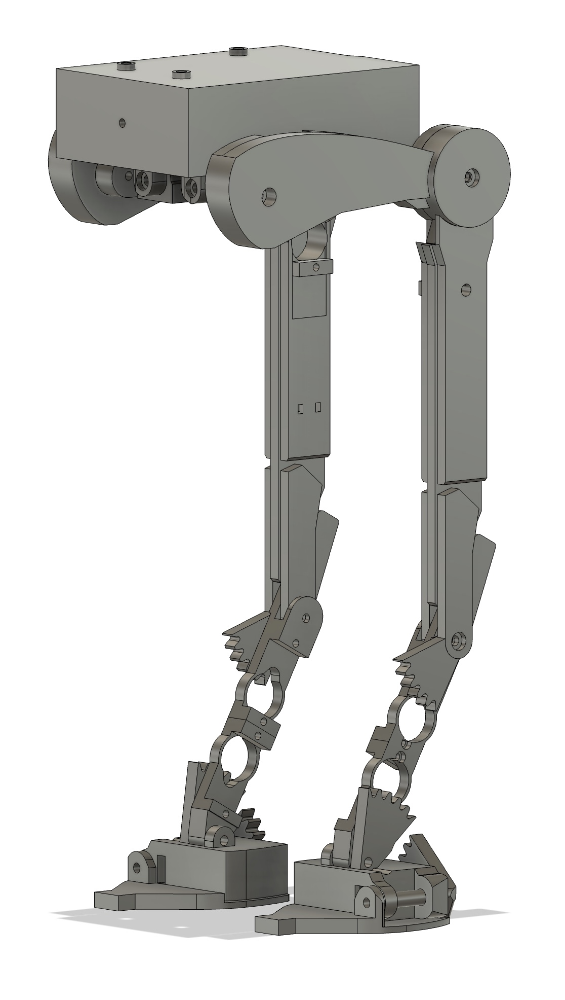
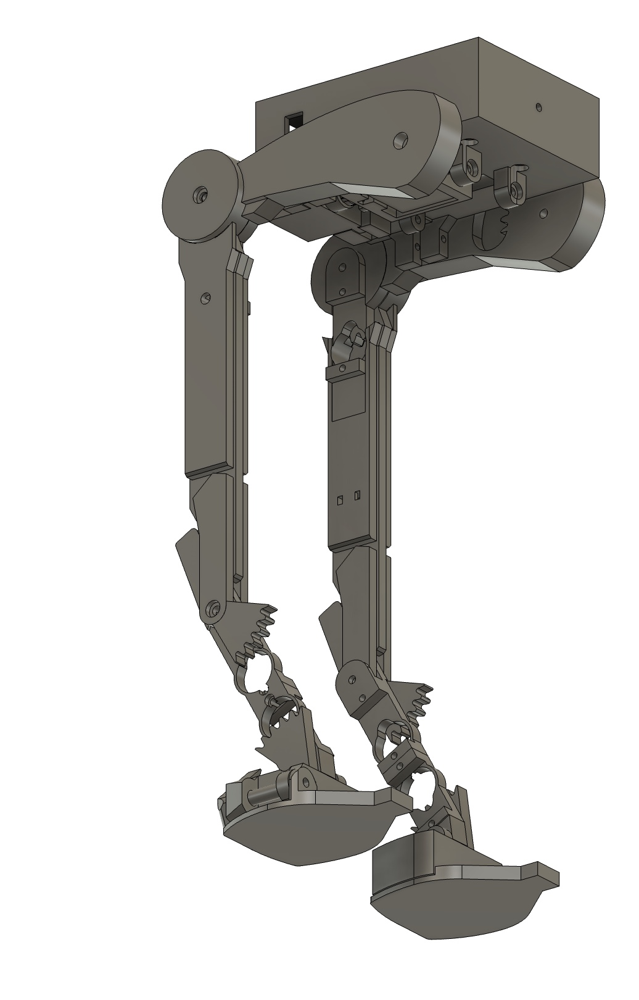
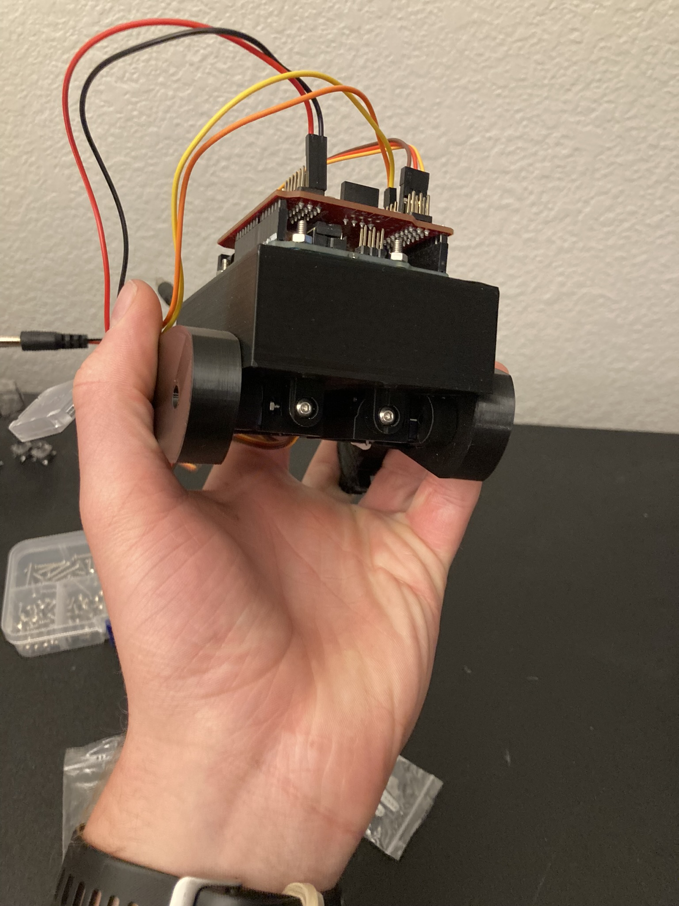
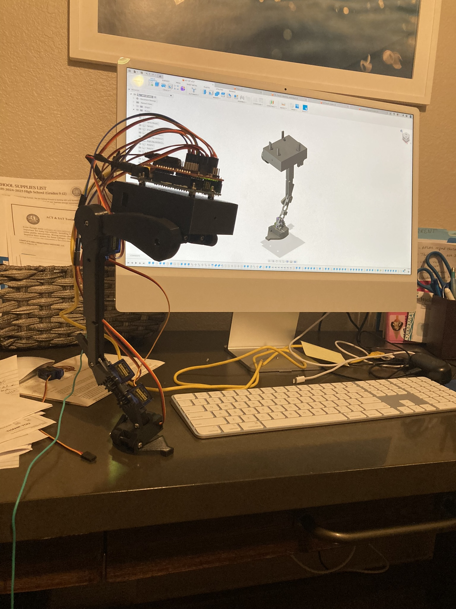
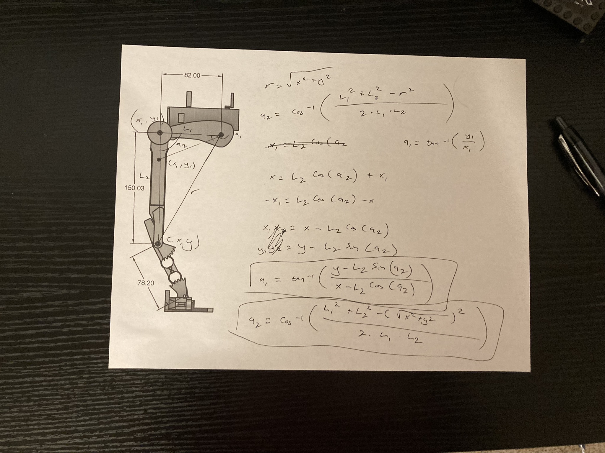

## The problem

A two-legged walker is a hard mechanism. It has to carry its own weight, stay
balanced through a gait, and do it with linkages and actuators that fit inside a
challenging shape. The AT-ST's silhouette is all overhanging body and thin,
reverse-jointed legs, which is exactly the wrong mass distribution for walking,
and exactly why it's an interesting thing to try to build.

This has been my long-running project since 2023, and it's where much of my initial love of electronics and basic mechanisms, and my knowledge of them, stems from.

## Prototyping the mechanism in LEGO

I started this project using LEGOs, as it was a building system I was very familiar with. I thought it would be a simple and easy task, as this project was quite similar to others I had done with LEGO.

This was the first design I had. It relied on one motor to turn the legs, and was quite simple.

After months of trying to make LEGOs work, I realized I needed to switch platforms. LEGOs were a great place to start and understand the physical constraints of this problem, but they did not have the capacity I needed to make this work.

## CAD

After learning how to 3D print in a class in school, I picked up Fusion 360 and bought my own printer. I quickly prototyped through many different iterations, landing on what you see below.

This design gives the hips and ankles two degrees of freedom, which allows the robot to place its center of mass on top of the center of the foot, giving it the greatest stability possible.

## Assembling the hardware

The hardware is printed parts, micro servos at each joint, a battery pack, and an Arduino Uno with a servo shield on top of the body.

Seeing the robot stand on one leg and balance with the weight of the power bank and other electronics was the highlight of this project. It told me that this could work, in a way that seeing it on a screen could not. 

## The kinematics

Once the leg had a defined geometry, the question became how to actually
control it. I had heard about inverse kinematics through touring a robotic welding facility, and thought this would be the perfect opportunity to try it out.

Because I started this project well before college and before AI had taken off, I did all the derivations by hand. I met with my math teacher, and we worked through them together, using the law of sines, cosines, and tangents to get all the angles to work. In the end, we were stumped by the fourth angle, but I created a simulation in Python that showed the first two joints working together perfectly. 

I could input any equation, and the ankle joint would follow that path exactly.

## Result

This project is still ongoing, and is one of my favorite personal projects. I am currently working on implementing a Bowden system, more similar to how animals articulate their joints. I have also done some research into a hydraulic system, and am very excited for the future of this project.
